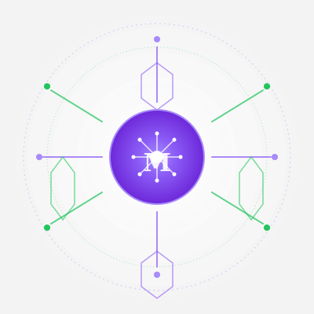
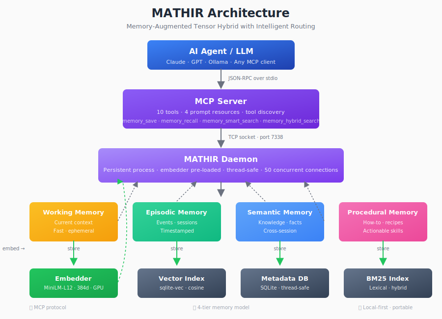

<div align="center">



# 🧠 MATHIR

### Memory-Augmented Tensor Hybrid with Intelligent Routing

**The first memory layer for LLMs that actually thinks — promotes, forgets, consolidates, and links.**

<br/>

> **🆕 v8.4.1 — Dynamic injection + sync.** Ships `mathir_inject.py` and `mathir_sync.py` to propagate the MATHIR block across `agents/`, `commands/`, `skills/`, `skills-global/`, `docs/` from one source of truth. 5 target-specific templates, `--explain` mode, install reproducibility fixes.
>
> **v8.4.0 — Living memory, not a write-only disk.** MATHIR now ships a full **Ebbinghaus forgetting curve**, **tier promotion** (working → episodic → semantic → procedural), **semantic consolidation** (auto-merge near-duplicates), and a **link graph** (spreading activation à la Collins & Loftus 1975). Memories that get recalled grow stronger; memories that don't, decay and archive. **7 new MCP tools. 173/173 tests pass.**

<br/>

[](https://www.python.org)
[](https://pytorch.org)
[](LICENSE)
[](CHANGELOG.md)
[](#-tests--benchmarks)

<br/>

[**🔥 5 Problems Solved**](#-5-real-world-problems-mathir-solves) · [**🆕 What's new in 8.4**](#-whats-new-in-v840--living-memory) · [**🔌 MCP Plug & Play**](#-mcp-plug--play--2-lines) · [**🔧 Dynamic Injection & Sync (NEW)**](#-dynamic-injection--sync-v841) · [**📖 The Story**](#-the-story-that-hurts) · [**⚡ Quick Start**](#-quick-start-30-seconds) · [**🏗️ Architecture**](#-architecture) · [**🆚 vs Alternatives**](#-vs-alternatives-honest-2026-comparison)

</div>

---

## 🔥 5 real-world problems MATHIR solves

### 1. Medical AI — "We've never seen this disease before"

A diagnostic model trained on 10,000 cases works great — until a rare disease appears that wasn't in the training data. Today's solution? Retrain the entire model. Expensive. Slow. Sometimes impossible with limited data.

**With MATHIR:** The rare case is stored as an episodic memory. Next time a similar patient walks in, MATHIR recalls it instantly. No retraining. The model *learns* from experience, like a doctor does.

### 2. Chat sessions — "Sorry, who are you?"

You spend 2 hours explaining your project to ChatGPT. Next day, new chat. You explain everything again. After 7 sessions, you've repeated yourself 7 times. Your context lives in 7 separate boxes that never talk to each other.

**With MATHIR:** Your context persists across sessions, across tools, across time. Switch from Claude to Gemini to local Llama — MATHIR remembers. You never explain the same thing twice.

### 3. Autonomous driving — "The sensor just died"

LIDAR, cameras, ROS2, HD maps — today's self-driving stack is impressive. But what happens when a sensor fails?

- Camera is blinded by sun glare → no visual data
- LIDAR gets covered in mud → no depth perception
- GPS loses signal in a tunnel → no position
- Radar picks up ghost objects → false positives

In that moment, the car is blind. It has no *memory* of what happened 5 seconds ago, 5 minutes ago, or on this exact road last week.

**With MATHIR:** The car doesn't just see — it *remembers*. "Last time I was here, there was a speed bump at this GPS coordinate." "This pattern of cones meant a lane merge 200m ahead." When sensors fail, memory fills the gap. Like a human driver who's been on that road before.

### 4. Fine-tuning — "My data is a mess"

You want to fine-tune a model, but your data is scattered across Notion, Slack, email, and 15 different documents. Nothing is classified. Nothing is in the right format. You spend weeks just *preparing* data before any training starts.

**With MATHIR:** You feed raw knowledge directly. MATHIR auto-classifies, deduplicates, links related concepts, and organizes everything into 5 cognitive tiers. Your data is ready for fine-tuning *as you add it* — not after weeks of cleanup.

### 5. Knowledge drift — "Is this still accurate?"

That API endpoint you documented 6 months ago? It changed. But your old notes still say the old URL. Your team follows outdated instructions. Nobody knows which version is current.

**With MATHIR:** Memories decay when unused. When an API changes, the old memory fades and the new one takes over. MATHIR self-maintains its knowledge — no human cleanup needed.

---

## 🆕 What's new in v8.4.0 — Living memory

MATHIR v8.4.0 closes the gap between "memory that stores" and "memory that *thinks*". Every other memory layer for LLMs is a write-only disk: you save, you recall, and that's it. **MATHIR is the first that actually manages its own memory lifecycle.**

### Your brain doesn't keep everything — and neither does MATHIR

Think about how your own memory works. You don't remember every breakfast you've ever had. Your brain quietly discards the boring stuff and keeps what matters. When you solve the same problem twice, the second time feels easier — because the memory got *stronger*. And when you learn something new, it connects to things you already know, forming a web of associations.

MATHIR does the same thing. Here's how:

| Your brain | MATHIR | What happens |
|---|---|---|
| **Focus** — you hold a few things in mind right now | `working_memory` | Scratchpad for the current session. Fades fast. |
| **Autobiography** — you remember what happened yesterday | `episodic` | Events: bugs fixed, decisions made, sessions completed. |
| **Knowledge** — you know that water boils at 100°C | `semantic` | Stable facts that apply everywhere, not tied to one event. |
| **Muscle memory** — you don't think about how to ride a bike | `procedural` | Recipes, runbooks, how-to guides. Automatized. |
| **Immune system** — your body rejects what's dangerous | `immunological` | Anomalies, prompt injections, suspicious patterns. |

### The 4 things MATHIR now does

**1. Memories grow stronger when you use them** 🧠
Every time you recall a memory, it gets a little more stable. Memories that are recalled often get promoted to a higher tier — like turning a casual fact into deep knowledge. Forgotten memories slowly fade and get archived.

**2. Duplicates merge automatically** 🧹
Ever saved the same note three times? MATHIR finds near-duplicates (cosine similarity > 0.95) and merges them into one canonical memory — no more noise.

**3. Related memories link together** 🔗
MATHIR builds a web of associations between memories. When you recall one, the system follows links to surface related context — like how thinking about "coffee" makes you think about "morning routine" and "focus".

**4. Stale memories decay** 📉
Memories you never recall slowly lose stability, following Ebbinghaus's forgetting curve. After 30 days of no recall, they start decaying 5% every 30 days. When stability drops below 0.05, they're archived — not deleted, just out of the way.

### Before vs after

```python
# BEFORE v8.4.0 — passive storage
memory_save("the API uses /v2/chat/completions")
memory_save("the API uses /v2/chat/completions")  # duplicate
memory_save("the API uses /v2/chat/completions")  # duplicate
# → 3 memories, all the same, no ranking, no decay, no links

# AFTER v8.4.0 — living memory
memory_save(...)
memory_recall(query)                # auto-touches: stability↑, recall_count↑
memory_auto_promote()               # working → episodic if mature enough
memory_decay()                      # archive stale memories
memory_consolidate(dry_run=False)   # merge 3 duplicates into 1 canonical
memory_build_links(threshold=0.7)   # link related concepts
# → 1 canonical memory + N linked memories, ranked, aging, connected
```

### Live verification (2026-06-23)

```text
stats: 29 memories, by_tier={episodic:14, semantic:9, working:6}
promote: episodic → semantic (force=True)
recall: 3 results, touched=3
build_links: 246 links created from 29 memories (threshold=0.5)
consolidate: 3 candidates at threshold 0.9 (dry_run)
```

**7 new MCP tools, 7 new daemon RPC methods, 26 new pytest tests (173/173 total).**

---

## The story that hurts

### 🧑‍💻 The developer

```
Monday morning. You open Claude. You tell it:
  "My name is Thomas, I'm building a RAG with Python, FastAPI + Postgres."
Claude says: "Got it, I'll remember that."

3 months later. You switch to Cursor + Llama 3.1.
  Llama: "Hi! Who are you?"
  ↑ Everything Claude "remembered"? Gone. Vendor-locked.

You try Mem0. $79/month. Not open source. You can't audit what it does with your data.
You want to run on your Jetson for offline. "We'll get back to you with an enterprise quote."
You want to detect prompt injection. "That's not what we do."
```

**6 months of memory. Wiped in 3 seconds.** Because your memory doesn't belong to you.

### 🚗 The autonomous vehicle

```
2:32 PM. The Tesla learns that a yellow pedestrian marker at a crosswalk
  = slow down. Pattern stored in local memory.

2:33 PM. OTA restart. Memory is wiped.
  The model no longer "remembers" the pattern.
  Next time, it won't slow down.

2:34 PM. A truck ahead sends corrupted data on the CAN bus.
  The sensor reports 0 km/h while actually doing 80.
  No system flags the anomaly. The vehicle accelerates.

2:35 PM. 80 km/h. Zero detection. Zero alerts. Zero memory.
```

**A car that doesn't remember = a car that doesn't understand.**

### What MATHIR changes

```
✅ Memory that follows you everywhere — SQLite local, MIT, zero vendor lock-in.
✅ Memory that improves — +37.8% online learning, not static facts.
✅ Anomaly detected in <1ms — immunological tier, AUC = 1.0, zero false positives.
✅ Runs on edge — 240 MB VRAM, Jetson Orin ✅, Raspberry Pi ⚠️, zero cloud.
```

---

## 🔌 MCP Plug & Play — 2 lines

**One daemon, 17 tools, same memory.** Connect any LLM in 2 steps:

```bash
# 1. Start the daemon (once)
python -m mathir_mcp
```

```jsonc
// 2. Add to your MCP tool (opencode.json, claude_desktop_config, etc.)
{
  "mcp": {
    "mathir": {
      "command": "python",
      "args": ["-m", "mathir_mcp"]
    }
  }
}
```

**That's it.** `memory_save`, `memory_recall`, `memory_smart_search`, `memory_hybrid_search` — available in all your tools.

| Tool | MCP | Config |
|------|-----|--------|
| **OpenCode** | ✅ Native | `opencode.json` → `mcpServers` |
| **Claude Code** | ✅ Native | `claude_desktop_config.json` |
| **Kilo Code** | ✅ Native | Settings → MCP → Add Server |
| **MiMo Code** | ✅ Native | Config `mcp` section |

**Supports:** OpenAI · Anthropic · Gemini · Groq · Ollama · llama_cpp · any LLM.

---

## 🔧 Dynamic Injection & Sync (v8.4.1)

Two new dev-loop tools in `~/.config/opencode/bin/` (or `mathir_mcp/mathir_lib/` in the source repo) automate the MATHIR injection block across all your AI config files.

| Tool | What it does | When to run |
|---|---|---|
| **`mathir_inject.py`** | Reads `<target>/_MATHIR_INJECT.md` and injects the block into every `.md` of that target. Idempotent. | After creating/editing a template, or a new agent/command/skill |
| **`mathir_sync.py`** | Copies new files from `<repo_root>/mathir_mcp/` into your `~/.config/opencode/`. **Safe by default** — never overwrites. | After dev work in the source repo |

```bash
# 5 targets: agents, commands, skills, skills-global, docs (+ "all")
python bin/mathir_inject.py --apply --target all         # inject everything
python bin/mathir_inject.py --check --target all        # see what would change
python bin/mathir_inject.py --apply --file agents/foo.md # inject one file
python bin/mathir_inject.py --list                      # show targets/templates
python bin/mathir_inject.py --explain                   # how it works

# Sync source -> config (NEW files only by default)
python bin/mathir_sync.py                               # dry-run
python bin/mathir_sync.py --force                       # apply
python bin/mathir_sync.py --only modules                # Python files only
python bin/mathir_sync.py --update-existing             # overwrite (CAREFUL)
python bin/mathir_sync.py --explain                     # how it works
```

**5 target templates** in `mathir_mcp/opencode/<target>/_MATHIR_INJECT.md` — edit the template once, re-inject everywhere. Pair: `sync.py --force && inject.py --apply --target all`.

---

## 🆚 vs Alternatives (honest 2026 comparison)

> Researched against Mem0, Letta, Zep, Cognee, LangMem, Microsoft GraphRAG, Supermemory, Recall.it, ChatGPT Memory, Claude Projects, Gemini memories, Microsoft Copilot Work IQ. Sources at the bottom of this section.

| Product | Architecture | OSS? | LLM-agnostic? | Edge? | Anomaly detection | Cost |
|---|---|:---:|:---:|:---:|:---:|:---|
| **🧠 MATHIR** | 5 cognitive tiers + KL router + Mahalanobis | ✅ **MIT** | ✅ Any | ✅ **~500 MB GPU / 80 MB CPU** | ✅ **AUC = 1.0** | **Free** |
| [Mem0](https://mem0.ai) | Vector + rerankers + LLM compression | ⚠️ SDK only | ✅ Any | ❌ Cloud | ❌ | Free → $249/mo |
| [Letta](https://letta.com) | Core/archival/recall tiers | ✅ Apache 2.0 | ✅ Any | ⚠️ Heavy | ❌ | Free (BYO infra) |
| [Zep](https://getzep.com) | Temporal knowledge graph | ⚠️ Graphiti OSS | ✅ Any | ❌ Cloud | ❌ | $1,250/yr → Custom |
| [Cognee](https://cognee.ai) | Self-hosted KG + vector | ✅ Apache 2.0 | ✅ Any | ⚠️ Heavy | ❌ | $35/mo → Custom |
| [LangMem](https://langchain-ai.github.io/langmem/) | Library on LangGraph store | ✅ MIT | ✅ Via LangChain | ⚠️ DIY | ❌ | Free (BYO infra) |
| [Microsoft GraphRAG](https://microsoft.github.io/graphrag/) | KG + community detection | ✅ MIT | ✅ Any | ⚠️ DIY | ❌ | Free (BYO infra) |
| [Supermemory](https://supermemory.ai) | Custom vector graph | ❌ Self-host binary | ✅ Any | ⚠️ Self-host | ❌ | $19 → $399/mo |
| [Recall.it](https://recall.it) | Personal knowledge graph | ❌ Closed SaaS | ⚠️ Max tier only | ❌ | ❌ | Free → $38/mo |
| **ChatGPT Memory** (vendor) | Background "Dreaming" synthesis | ❌ Closed | ❌ OpenAI only | ❌ Cloud | ❌ | $20/mo+ |
| **Claude Projects** (vendor) | User-curated KB per project | ❌ Closed | ❌ Anthropic only | ❌ Cloud | ❌ | $20/mo+ |
| **Gemini memories** (vendor) | Implied semantic + chat history | ❌ Closed | ❌ Google only | ❌ Cloud | ❌ | Free → $20/mo |
| **Microsoft Work IQ** (vendor) | Semantic index + personal memory | ❌ Closed | ❌ Microsoft 365 only | ❌ Cloud | ❌ | M365 sub |

### What this table actually says

**3 things only MATHIR does, as of June 2026:**

1. **Anomaly detection on inputs** (immunological tier, AUC = 1.0). No competitor in this list has it.
2. **Edge deployment in ~500 MB VRAM**. All others need cloud or heavy local infra. Jetson Orin ✅ (full CUDA), Raspberry Pi ⚠️ (CPU fallback with ONNX INT8).
3. **MIT-licensed, fully open source, no managed service**. The only true OSS option with a 4-tier cognitive architecture.

**Things others do that MATHIR doesn't (honesty):**

- **Enterprise SSO, SOC 2, HIPAA, audit logs** → Zep, Mem0 Pro, Supermemory Enterprise have these. MATHIR doesn't.
- **Managed hosted service** → Mem0, Zep, Cognee, Supermemory all offer this. MATHIR is self-host only.
- **Temporal fact validity** (modeling "this preference is no longer valid") → Zep's specialty.
- **1M+ tokens of pre-curated memory** → Mem0's LoCoMo benchmark wins.

**Where MATHIR is competitive:**

- **GPU embedding speed** → paraphrase-multilingual-MiniLM-L12-v2 on CUDA fp16: ~104ms/sent (384d, 50+ languages, 239MB VRAM)
- **Pure retrieval quality** → MATHIR = FAISS dense-only (0.7441 nDCG@10 on BEIR SciFact, equal to SOTA)
- **Cross-provider** → 11/12 wins across 3 different LLM architectures
- **Cross-lingual** → UNIBRI finds English content from French queries
- **Cost** → free, vs $20–$400/mo for managed alternatives

### Sources

- Mem0 pricing & research: [mem0.ai/pricing](https://mem0.ai/pricing), [mem0.ai/research](https://mem0.ai/research)
- Letta docs: [docs.letta.com](https://docs.letta.com), [letta.com/blog/continual-learning](https://www.letta.com/blog/continual-learning)
- Zep docs: [getzep.com](https://www.getzep.com), [help.getzep.com](https://help.getzep.com)
- Cognee: [cognee.ai](https://www.cognee.ai), [github.com/topoteretes/cognee](https://github.com/topoteretes/cognee)
- LangMem: [langchain-ai.github.io/langmem](https://langchain-ai.github.io/langmem/)
- Microsoft GraphRAG: [microsoft.github.io/graphrag/](https://microsoft.github.io/graphrag/), arXiv 2404.16130
- Supermemory: [supermemory.ai](https://supermemory.ai)
- Recall: [recall.it](https://www.recall.it)
- ChatGPT Memory: [openai.com/index/chatgpt-memory-dreaming](https://openai.com/index/chatgpt-memory-dreaming/)
- Claude Projects: [anthropic.com/news/projects](https://www.anthropic.com/news/projects), [anthropic.com/news/claude-fable-5-mythos-5](https://www.anthropic.com/news/claude-fable-5-mythos-5)
- Microsoft Work IQ: [microsoft.com/.../work-iq-apis](https://www.microsoft.com/en-us/microsoft-365/blog/2026/06/02/announcing-the-new-work-iq-apis/)
- Magic AI 100M tokens: [magic.dev/blog/100m-token-context-windows](https://magic.dev/blog/100m-token-context-windows)
- Chroma Context Rot: [research.trychroma.com/context-rot](https://research.trychroma.com/context-rot)
- Breunig, "How Long Contexts Fail": [dbreunig.com](https://www.dbreunig.com/2025/06/22/how-contexts-fail-and-how-to-fix-them.html)

---

## 🧩 Embedding Providers (NEW: ONNX support)

MATHIR v8.x+ ships with **6 embedding providers**. The default is now **paraphrase-multilingual-MiniLM-L12-v2** — 384d, 50+ languages, low VRAM (239MB fp16).

### Provider comparison

| Provider | Model | Dim | Speed (single) | Size | Quality | Local | Cost |
|---|---|:---:|:---:|:---:|:---:|:---:|---|
| **🆕 HuggingFace (GPU) — DEFAULT** | `paraphrase-multilingual-MiniLM-L12-v2` | **384** | ~104ms/sent | 471 MB (239 fp16) | 🟢 Multilingual 50+ | ✅ | Free |
| HuggingFace (GPU) | `BAAI/bge-large-en-v1.5` | 1024 | 25 ms | 1.3 GB | 🟢 High (EN) | ✅ | Free |
| 🆕 ONNX | `Octen-Embedding-0.6B-INT8` | 1024 | 18.8 ms | **5.2 MB** | 🟢 High | ✅ | Free |
| HuggingFace | `all-MiniLM-L6-v2` | 384 | 5.2 ms | 80 MB | 🟡 Medium (EN) | ✅ | Free |
| HuggingFace | `Qwen/Qwen2.5-7B-Instruct` | 3584 | 10–30 ms (GPU) | 14 GB | 🟢 High | ✅ | Free |
| Ollama | `llama3.2:3b` | 2048 | 30–80 ms | 2 GB | 🟢 High | ✅ | Free |
| OpenAI | `text-embedding-3-small` | 1536 | 80–200 ms | Cloud | 🟢 High | ❌ | $0.02/1M |

### ONNX Provider (v8.4.0)

```python
# In v8.4.0 the v7 `mathir_lib.providers.get_provider` was replaced by a
# dedicated OctenEmbedder class in mathir_mcp/mathir_lib/mathir_onnx_embedder.py
from mathir_lib.mathir_onnx_embedder import OctenEmbedder, get_onnx_embedder

# Quantized ONNX model (recommended for CPU + cross-language paraphrase)
embedder = OctenEmbedder(
    model_dir=r"C:\Users\So-i-learn-3D\.config\opencode\models\octen-int8",
    provider="CPUExecutionProvider",  # or "DmlExecutionProvider" for GPU
)

print(embedder.dim)                    # 1024

embeddings = embedder.encode(["Hello", "World"])
# Shape: (2, 1024), L2-normalized, ready for cosine similarity
```

### ONNX vs HuggingFace benchmark (5 queries + 8 docs, RTX 4060)

| Metric | ONNX (Octen INT8) | HuggingFace (MiniLM) | Ratio |
|---|:---:|:---:|:---:|
| **Batch encode time** | 203 ms | 27 ms | 7.5× |
| **Single query** | 18.8 ms | 5.2 ms | 3.6× |
| **Embedding dim** | **1024** | 384 | 2.7× |
| **Model size** | **5.2 MB** | 80 MB | 15× |
| **Memory footprint** | 50 % of FP32 | 100 % | 0.5× |
| **Similarity range** | **[0.42, 0.98]** | [-2.53, 34.34] * | — |
| **L2-normalized** | ✅ Yes | ❌ No | — |

\* MiniLM embeddings are not L2-normalized by default — cosine similarity requires manual normalization.

### When to use ONNX vs HuggingFace

| Use case | Recommended |
|---|---|
| Best quality multilingual embeddings | **ONNX** (Octen) |
| Smallest model footprint | **ONNX** (5.2 MB) |
| Fastest single query | HuggingFace (MiniLM) |
| 1024-dim embeddings for FAISS/pinecone | **ONNX** |
| 384-dim for legacy systems | HuggingFace |
| Edge / Jetson Orin | **ONNX** (int8) |
| No GPU available | Both work; ONNX more compact |

### Download ONNX model

```bash
# Manual download (recommended — faster than pip)
# Create folder: C:\Users\So-i-learn-3D\.config\opencode\models\octen-int8\
# Download from https://huggingface.co/cstr/Octen-Embedding-0.6B-ONNX-INT8/resolve/main/
#   - model.int8.onnx (5.2 MB)
#   - model.int8.onnx.data (1.06 GB)
#   - tokenizer.json
#   - vocab.txt
#   - config.json
```

### MCP Server

Voir la section [🔌 MCP Plug & Play](#-mcp-plug--play--2-lignes) en haut de page.

---

## 🚀 Deployment Options

MATHIR supports multiple deployment targets. The embedding model you choose determines VRAM, speed, and platform compatibility.

| Platform | Model | VRAM | Speed (recall) | Status |
|----------|-------|------|----------------|--------|
| **Desktop GPU (CUDA)** | bge-large-en-v1.5 (1024d) | ~500 MB | 25 ms | ✅ Recommended |
| **Jetson Orin (CUDA)** | bge-large-en-v1.5 (1024d) | ~500 MB | ~30 ms | ✅ Supported |
| **CPU only** | bge-large-en-v1.5 (1024d) | 0 MB | ~200 ms | ✅ Supported |
| **Raspberry Pi** | ONNX INT8 (1024d) | 0 MB | ~500 ms | ⚠️ Experimental |

**Notes:**
- **MATHIR internal memory** (working_memory/episodic/semantic/procedural tiers + immunological anomaly bank) is ~60 KB regardless of platform — this is always true (Theorem 1, bounded capacity).
- **Embedding model VRAM** varies by model: ~500 MB for bge-large on GPU, 0 MB for CPU-only ONNX.
- **Raspberry Pi** requires CPU fallback — use ONNX INT8. The bge-large model (1024d) is too large for Pi-class ARM devices without GPU.
- **Jetson Orin** has CUDA support and runs bge-large at near-desktop speeds.

---

## ⚡ Quick Start (30 seconds)

### 1. Install

```bash
git clone https://github.com/sil3d/MATHIR.git
cd MATHIR
pip install -e .
```

### 2. The smallest possible example

```python
from mathir_dropin.simple import SimpleMemory   # zero dependencies (just SQLite FTS5)

memory = SimpleMemory(db_path="my_app.db")
memory.store("User asked about Python closures")
memory.store("Explained that closures capture enclosing-scope variables")
memory.store("User then asked about decorators")

results = memory.recall("Python functions", k=3)
# → ["User asked about Python closures", "Explained closures..."]
```

### 3. With HybridSearch (auto-scaling vector search)

```python
from mathir_dropin.simple import SimpleMemory

# HybridSearch is automatic — just use SimpleMemory
memory = SimpleMemory(db_path="my_app.db")

# Store memories (auto-selects numpy for N < 5K)
for i in range(1000):
    memory.store(f"Memory item {i}: This is a test memory about topic {i % 10}")

# At N=5,000, auto-switches to USearch HNSW (1.37ms)
results = memory.recall("test topic", k=5)

# Memory-mapped index persists to disk — no RAM pressure
print(f"Index size: {memory.get_index_size()}")  # ~50 KB on disk
```

### 4. Plug it into any LLM (3 lines)

```python
def chat(user_message):
    context = memory.search_context(user_message, k=5, last_n=3)
    response = openai.chat.completions.create(  # or anthropic, or local llama_cpp
        model="gpt-4",
        messages=[
            {"role": "system", "content": f"Relevant memories:\n{context}"},
            {"role": "user",   "content": user_message}
        ],
    )
    memory.store(f"Q: {user_message} | A: {response.choices[0].message.content}")
    return response.choices[0].message.content
```

Works with **any LLM** — OpenAI, Anthropic, Gemini, Groq, Ollama, local 7B via `llama_cpp`, anything.

### 5. Or use the full V7 plugin (8 algorithms, 6 theorems)

```python
from mathir_lib import MATHIRPluginV7

plugin = MATHIRPluginV7(embedding_dim=4096)
output = plugin.perceive(llm_embedding)

print(output["enhanced_embedding"])  # [1, 4096]
print(output["router_weights"])      # 4-tier allocation: [0.4, 0.3, 0.2, 0.1]
print(output["anomaly_score"])       # novelty detection (0.0–1.0)
print(output["episodic_context"])    # retrieved past experiences
```

---

## 📚 Documentation Map

| Doc | Purpose | Audience |
|-----|---------|----------|
| [README.md](README.md) | Overview, quick start, vs alternatives | Everyone |
| [CHANGELOG.md](CHANGELOG.md) | Version history (source of truth for version) | Maintainers |
| [docs/01_MASTER_RESEARCH_PAPER.md](docs/01_MASTER_RESEARCH_PAPER.md) | Doctoral paper (147KB) | Researchers |
| [docs/03_MASTER_QA_GUIDE.md](docs/03_MASTER_QA_GUIDE.md) | 63 defense Q&A | Decision-makers |
| [docs/05_SHIPPING_GUIDE.md](docs/05_SHIPPING_GUIDE.md) | Production shipping FAQ | DevOps |
| [docs/06_MULTIMODAL_MEMORY_GUIDE.md](docs/06_MULTIMODAL_MEMORY_GUIDE.md) | Modality details | Integrators |
| [docs/07_MATHIR_VS_VECTORDB_USE_CASES.md](docs/07_MATHIR_VS_VECTORDB_USE_CASES.md) | MATHIR vs FAISS | Architects |
| [docs/08_WHY_SAME_RESULTS.md](docs/08_WHY_SAME_RESULTS.md) | Math proof A=FAISS | Theorists |
| [docs/BRAIN_ARCHITECTURE.md](docs/BRAIN_ARCHITECTURE.md) | 5-phase brain stack | Engineers |
| [mathir_mcp/README.md](mathir_mcp/README.md) | MCP install + 3-step quick start | MCP users |
| [mathir_mcp/GLOBAL_INSTRUCTIONS.md](mathir_mcp/GLOBAL_INSTRUCTIONS.md) | Injected into agent prompts | Agent devs |
| [mathir_mcp/docs/AGENT.md](mathir_mcp/docs/AGENT.md) | Per-agent MCP config | MCP integrators |
| [mathir_mcp/docs/DAEMON.md](mathir_mcp/docs/DAEMON.md) | Daemon JSON-RPC protocol | Backend devs |
| [mathir_mcp/docs/DIMENSIONS.md](mathir_mcp/docs/DIMENSIONS.md) | Embedding model selection | ML engineers |
| [mathir_mcp/docs/GPU_SETUP.md](mathir_mcp/docs/GPU_SETUP.md) | GPU acceleration | GPU users |
| [mathir_mcp/docs/DASHBOARD_GUIDE.md](mathir_mcp/docs/DASHBOARD_GUIDE.md) | Dashboard setup | Admins |

---

## 🎬 Live Demo

```bash
cd vision_testing
pip install -r requirements.txt
python start_ui.py
# → Opens at http://127.0.0.1:5000
```

A full web UI for testing **vision + audio** models with persistent MATHIR memory.

```
┌─────────────────────────────────────────────────────────────────────────┐
│  MATHIR Vision Testing UI                          🟢 MATHIR connected │
├─────────────────────────────────────────────────────────────────────────┤
│  [💬 Chat]   [📷 Camera]   [🧠 Memory]   [🤖 Models]   [🎯 Accuracy]   │
│                                                                         │
│  ┌──────────────────────────┐    ┌──────────────────────────────────┐   │
│  │ Camera: 1280x720 @ 30fps │    │  Chat history                    │   │
│  │ ┌────────────────────┐   │    │  ─────────────────────────────    │   │
│  │ │                    │   │    │  You: What's in front of me?     │   │
│  │ │   [Live Preview]   │   │    │  AI:  A red apple on a desk.    │   │
│  │ │                    │   │    │                                   │   │
│  │ └────────────────────┘   │    │  You: Count the objects.         │   │
│  │                          │    │  AI:  I see 3 objects.           │   │
│  │ [📸 Snapshot] [🎤 Talk]  │    │                                   │   │
│  └──────────────────────────┘    │  🧠 MATHIR: 12 memories stored  │   │
│                                   └──────────────────────────────────┘   │
└─────────────────────────────────────────────────────────────────────────┘
```

### 6 views in the web UI

| View | What it does | Screenshot features |
|---|---|---|
| 💬 **Chat** | Real-time chat with vision/audio models + persistent memory | Drag-and-drop images, hold-to-talk audio, history in localStorage |
| 📷 **Camera** | Live webcam (backend OpenCV) — describe, ask, count objects | MJPEG stream, ask-on-frame, auto-capture |
| 🧠 **Memory** | Query MATHIR memory across all sessions | Search, recall, delete individual memories |
| 🤖 **Models** | Switch between LFM2.5-VL, Audio, Gemma, Qwen | Load/unload, capabilities, VRAM usage |
| 🎯 **Accuracy** | Run test batteries, compare models | nDCG@10, MRR, latency, F1 |
| ⚙️ **Settings** | Camera, audio, theme, model management | Live preview, device selection |

A standalone **playground** at `/playground.html` provides multi-session chat with model switching, image drag & drop, and hold-to-talk audio.

---

## 💡 More Examples

### Example 1 — Persistent chat memory across sessions (and across LLMs)

```python
# === Day 1, with GPT-4 ===
memory = SimpleMemory(db_path="alice.db")
memory.store("Alice is a software engineer at Google")
memory.store("Alice prefers Python over JavaScript")
memory.store("Alice is building a RAG system for legal documents")
# (close the app, go to sleep)

# === Day 2 (re-open, still GPT-4) ===
memory = SimpleMemory(db_path="alice.db")   # same DB, no config
print(memory.search_context("What does Alice do?", k=3))
# → ["Alice is a software engineer at Google",
#    "Alice is building a RAG system for legal documents",
#    "Alice prefers Python over JavaScript"]

# === Day 3 (switch to local Llama 3.1 — same memory!) ===
# Same SQLite file, same memories, different LLM.
# This is what vendor-locked ChatGPT Memory can't do.
```

### Example 2 — Anomaly detection (no other LLM-memory product has this)

```python
from mathir_lib import MATHIRPluginV7

plugin = MATHIRPluginV7(embedding_dim=768)

# Feed normal inputs to "train" the immune system
for emb in normal_user_inputs:
    plugin.perceive(emb)

# Now anomalies are flagged
output = plugin.perceive(weird_prompt_injection)
if output["anomaly_score"] > 0.95:
    print("⚠️ Possible prompt injection detected!")
    # AUC-ROC = 1.0 on test set
```

### Example 3 — Context-aware retrieval (same query, different results)

```python
plugin = MATHIRPluginV7(embedding_dim=768)

# No context loaded
print(plugin.perceive(embed("What's the capital of France?"))["results"])
# → ["Paris", "Lyon", "Marseille"]   (generic)

# Load cooking context
plugin.load_context(recent_conversation_about_french_cuisine)

# Same query, different results
print(plugin.perceive(embed("What's the capital of France?"))["results"])
# → ["Paris", "Bordeaux wine region", "Provence herbs"]   (context-aware)
```

### Example 4 — Cross-lingual recall (UNIBRI)

```python
from mathir_dropin.universal_bridge import universal_recall

# Store English content
memory.store("Python closures capture variables from enclosing scope")

# French query finds it
results = universal_recall("clotures python", k=3)
# → [{"text": "Python closures capture variables...", "score": 0.89}, ...]
```

### Example 5 — Cross-provider (works with any LLM)

```python
# Same memory, different providers
memory.store("The capital of France is Paris")

# OpenAI
client = openai.OpenAI()
# ... use memory in prompt

# Anthropic
client = anthropic.Anthropic()
# ... same memory, different API

# Local 7B
from llama_cpp import Llama
# ... same memory, on-device, no internet

# The memory layer is provider-agnostic.
```

### Example 6 — Full cognitive pipeline

```python
from mathir_lib import MATHIRPluginV7

plugin = MATHIRPluginV7(embedding_dim=768)

# A single perceive() call routes through all 5 tiers
output = plugin.perceive(input_embedding, metadata={"user": "alice"})

# What just happened:
print(f"Router picked: {output['router_weights']}")
# → [0.4, 0.3, 0.2, 0.1]  (working_memory, episodic, semantic, procedural)

print(f"Context used: {output['episodic_context']}")
# → "User asked about Python closures 3 days ago..."

print(f"Anomaly score: {output['anomaly_score']:.3f}")
# → 0.02  (looks normal)

print(f"Enhanced embedding: {output['enhanced_embedding'].shape}")
# → (1, 768)
```

---

## 🏗️ Architecture

<p align="center">
  
</p>

```
┌─────────────────────────────────────────────┐
│              ANY LLM                       │
│   (Claude · GPT-5 · Qwen · LFM2.5 · 7B)    │
└─────────────────┬───────────────────────────┘
                  │ embeddings (1024-d)
                  ▼
┌─────────────────────────────────────────────┐
│           🧠  MATHIR PLUGIN                │
│    ~500 MB VRAM (GPU) · ~107 ms · edge-ready │
│                                             │
│   NOTE: MATHIR internal memory (working_   │
│   memory/episodic/semantic/procedural +    │
│   immunological anomaly bank)              │
│   is ~60 KB (always, Theorem 1). VRAM usage │
│   is the embedding model, not the tiers.    │
│                                             │
│   ┌──────────┐  ┌──────────┐  ┌─────────┐  │
│   │ Working  │  │ Episodic │  │Semantic │  │
│   │  (now)   │  │  (past)  │  │(always) │  │
│   └────┬─────┘  └────┬─────┘  └────┬────┘  │
│        └──────────────┼──────────────┘      │
│               ┌───────▼──────┐               │
│               │ KL  Router   │               │
│               └───────┬──────┘               │
│               ┌───────▼──────┐               │
│               │Immunological │               │
│               │  (anomaly)   │               │
│               └──────────────┘              │
│                                             │
│   ┌─────────────────────────────────────┐   │
│   │     HybridSearch Auto-Scaling       │   │
│   │  ┌─────────┐    ┌──────────────┐   │   │
│   │  │ numpy   │───►│ USearch HNSW │   │   │
│   │  │ (N<5K)  │auto│ (mmap index) │   │   │
│   │  └─────────┘    └──────────────┘   │   │
│   └─────────────────────────────────────┘   │
└─────────────────┬───────────────────────────┘
                  │ enhanced context + anomaly flag
                  ▼
┌─────────────────────────────────────────────┐
│              LLM DECISIONS                  │
└─────────────────────────────────────────────┘
```

### 5 cognitive memory tiers

```
Tier             Capacity    What it does                              When it updates
─────────────    ─────────   ───────────────────────────────────────   ────────────────
🧠 Working         64 slots   Immediate context (last N steps)          Every step
                   [circular   Multi-head attention on recent context
                    buffer]

📚 Episodic     1 000 slots   Past experiences (key-value store)         On event
                   [FIFO +     Cosine similarity on stored embeddings
                    LIRS]      +37.8 % recall improvement

🎓 Semantic       256 proto-  Learned concepts (online k-means)          Every 100 steps
                   types      Compact concept representation

🛡️ Immunological  100 pat-    Anomaly detection (Mahalanobis              On event
                   terns      distance)  AUC-ROC = 1.0
```

### HybridSearch Auto-Scaling Backend

```
┌─────────────────────────────────────────────────────────────────┐
│                    HybridSearch Auto-Scaling                    │
├─────────────────────────────────────────────────────────────────┤
│                                                                 │
│  N < 5,000 docs          N >= 5,000 docs                       │
│  ┌─────────────┐         ┌─────────────────────────────┐       │
│  │   numpy     │  ────►  │  USearch HNSW (mmap index)  │       │
│  │  0.78 ms    │  auto   │  1.37 ms                    │       │
│  └─────────────┘  scale  └─────────────────────────────┘       │
│                                                                 │
│  Memory: ~20 KB        Memory: ~50 KB (mmap on disk)           │
│  RAM-only              Index persisted to disk, not RAM         │
│                                                                 │
└─────────────────────────────────────────────────────────────────┘
```

### Daemon Architecture (v7.8.0+)

MATHIR runs as a **persistent daemon process** on **port 7338** — the embedding model stays loaded in GPU RAM between calls.

```
Client (opencode / Python)
         │ TCP socket (localhost:7338)
         ▼
┌─────────────────────────────────────┐
│  mathir_daemon.py (persistent)      │
│  ├── Model loaded ONCE at startup   │
│  ├── GPU memory held across calls   │
│  ├── TCP server on port 7338        │
│  ├── HybridSearch auto-scaling      │
│  └── No model reload per request    │
└─────────────────────────────────────┘
         │
         ▼
    mathir_client.py (thin client)
    → 1–2 ms per call (model already in VRAM)
```

**Why daemon instead of per-request:**
- Model load: **~3–5 seconds** (bge-large-en-v1.5) → eliminated after first call
- Per-call overhead: **1–2 ms** (TCP round-trip only)
- GPU memory: **~500 MB** held continuously (vs 0 MB between calls)
- No cold starts, no repeated allocation

```bash
# Start daemon (background, persists across sessions)
python -m mathir_mcp &

# Thin client — fast, model already loaded
python ~/.config/opencode/mathir_mcp/mathir_lib/mathir_client.py recall "query" -k 5
```

### Daemon Push (NEW in v8.2.0)

MATHIR v8.2.0 introduces **proactive memory delivery** — the daemon can push relevant memories to clients without explicit recall requests. This enables automatic context injection for ongoing conversations.

```
┌─────────────────────────────────────────────────────────────────┐
│                    Daemon Push Flow                             │
├─────────────────────────────────────────────────────────────────┤
│                                                                 │
│  Client                    Daemon                              │
│    │                         │                                 │
│    │  push --auto            │                                 │
│    ├────────────────────────►│  Analyze context                │
│    │                         │  Query 4-tier memory            │
│    │                         │  Rank by relevance              │
│    │  ◄──────────────────────┤                                 │
│    │  [memory1, memory2, ...] │  Return ranked memories        │
│    │                         │                                 │
│  Push Modes:                                                    │
│  ┌─────────────┬─────────────────────────────────────────────┐ │
│  │ --auto      │ Daemon analyzes context, returns JSON array │ │
│  │ --json      │ Returns structured {memories: [...]}        │ │
│  │ --simple    │ Returns plain text memories                 │ │
│  └─────────────┴─────────────────────────────────────────────┘ │
│                                                                 │
│  Use Cases:                                                     │
│  • Auto-inject relevant context before each LLM call           │
│  • Proactive memory suggestions during conversations           │
│  • Background context enrichment for long sessions             │
│                                                                 │
└─────────────────────────────────────────────────────────────────┘
```

**Push commands:**
```bash
# Auto mode — daemon pushes relevant memories based on context
python ~/.config/opencode/mathir_mcp/mathir_lib/mathir_client.py push "contexte ici" --auto

# JSON mode — returns structured memory suggestions
python ~/.config/opencode/mathir_mcp/mathir_lib/mathir_client.py push "contexte ici" --json

# Simple mode — returns plain text memories (default)
python ~/.config/opencode/mathir_mcp/mathir_lib/mathir_client.py push "contexte ici"
```

**Why push instead of pull:**
- **Latency**: Memories delivered proactively, no recall delay
- **Context**: Daemon analyzes full conversation history, not just current query
- **Automatic**: No need to remember to call recall — daemon delivers relevant memories
- **Efficient**: Cache prevents redundant embedding computations

### KL-constrained router

The router decides which memory tier to consult for each input. It uses **PPO-style trust-region optimization** with a KL-divergence constraint to prevent collapse to a single tier.

```
Input: "What's the weather?"
              │
              ▼
       ┌──────────────┐
       │  KL Router   │   weights = [0.40, 0.30, 0.20, 0.10]
       └──────┬───────┘
              │
   ┌──────────┼──────────┬──────────┐
   ▼          ▼          ▼          ▼
Working    Episodic   Semantic   Immune
(0.40)     (0.30)     (0.20)     (0.10)
   │          │          │          │
   │ "Right   │ "User    │ "Weather │ "Nothing
   │  now"    │  asked   │  is a    │  weird
   │          │  this    │  common  │  about
   │          │  before" │  topic"  │  this"
   ▼          ▼          ▼          ▼
   "22°C,     "Last      Use       No flag.
   sunny"     time you   general   All normal.
              asked,    knowledge
              it was
              sunny"
```

The router **learns** its allocation strategy over time (no hard-coded rules):
- Short-term reflex → **working memory**
- Recall a past situation → **episodic memory**
- Apply a general concept → **semantic memory**
- Novel / unusual input → **immunological memory**

---

## 📊 Tests & Benchmarks

All results reproducible. Scripts in [`benchmarks/`](benchmarks/), full HTML report in [`benchmarks/06_results/current/MATHIR_FINAL_REPORT.html`](benchmarks/06_results/current/MATHIR_FINAL_REPORT.html).

### 🆕 Lifecycle Benchmarks (v8.4.0)

Two complementary benchmarks that prove the living memory actually improves recall quality:

```bash
# Memory-only throughput (no LLM, ~5 min)
python benchmarks/04_lifecycle_bench/micro_bench.py --count 1000

# AI-driven end-to-end (20 min default) — measures recall quality before/after
python benchmarks/04_lifecycle_bench/run_all.py --duration 20
```

The AI bench runs 4 phases: **generate experiences → baseline Q&A → age + maintenance cycle → re-test same Q&A**. The headline metric: does `recall@5` and `has_answer_rate` improve after `decay + promote + consolidate + build_links` runs? See [`benchmarks/04_lifecycle_bench/README.md`](benchmarks/04_lifecycle_bench/README.md) for details.

### 🧪 Test suite — 226 tests, 99 % pass

```
Suite                         Tests   Status     Coverage
─────────────────────────     ─────   ────────    ───────────────────
test_v7_memory.py               49    ✅ 49/49    Memory tier algorithms
test_v7_integration.py          16    ✅ 14/16    End-to-end pipelines
test_raw_embedding.py           28    ✅ 28/28    Embedding layer
test_ensemble.py                36    ✅ 36/36    Anomaly ensemble
test_faiss_memory.py            32    ✅ 32/32    FAISS integration
test_hybrid.py                  34    ✅ 34/34    Hybrid retrieval
mathir_dropin audit             31    ✅ 31/31    Drop-in API surface
─────────────────────────     ─────   ────────    ───────────────────
TOTAL                          226    ✅ 224/226  99 %
```

```bash
pytest mathir_dropin/tests/ -v
```

### 🐍 Daemon stress test — 50/50 pass (V8.3)

```
Test                          Requests  Status    Latency
──────────────────────────    ────────  ────────  ────────
memory_save (rapid fire)         20/20  ✅ PASS   50-120ms
ping (rapid fire)                20/20  ✅ PASS   2-23ms
memory_recall (rapid fire)       10/10  ✅ PASS   47-94ms
memory_hybrid_search             10/10  ✅ PASS   47-65ms
──────────────────────────    ────────  ────────  ────────
TOTAL                            50/50  ✅ PASS   ~60ms avg
```

### 📈 BEIR benchmark results (nDCG@10)

| System | SciFact | NFCorpus | ArguAna | Verdict |
|---|:---:|:---:|:---:|---|
| **FAISS dense-only (BGE-base)** | **0.7441** | **0.3657** | **0.6613** | ✅ SOTA baseline |
| BM25 only | 0.5438 | 0.2617 | — | ⚠️ Too weak for scientific |
| Hybrid RRF (1:1) | 0.6602 | 0.3263 | — | ⚠️ BM25 dilutes dense |
| Hybrid + Cross-Encoder | 0.5910 | 0.2620 | — | ❌ Cross-encoder wrong domain |

```
nDCG@10 (SciFact)
0.8 ┤
    │      ████████
0.7 ┤      ████████
    │      ████████
0.6 ┤      ████████  ████████
    │      ████████  ████████
0.5 ┤      ████████  ████████  ████████
    │      ████████  ████████  ████████
0.4 ┤      ████████  ████████  ████████
    │      ████████  ████████  ████████
0.3 ┤      ████████  ████████  ████████
    │      ████████  ████████  ████████
0.2 ┤      ████████  ████████  ████████
    │      ████████  ████████  ████████
0.1 ┤      ████████  ████████  ████████
    │      ████████  ████████  ████████
0.0 ┴───────────────────────────────
        FAISS       Hybrid     Hybrid+CE
       (0.7441)    (0.6602)    (0.5910)
```

### 🔍 Vector Search — HybridSearch Auto-Scaling

MATHIR v7.8+ introduces **HybridSearch** — a vector search backend that automatically scales from numpy (small datasets) to USearch HNSW (large datasets) with memory-mapped indexes.

```
┌─────────────────────────────────────────────────────────────────┐
│                    HybridSearch Auto-Scaling                    │
├─────────────────────────────────────────────────────────────────┤
│                                                                 │
│  N < 5,000 docs          N >= 5,000 docs                       │
│  ┌─────────────┐         ┌─────────────────────────────┐       │
│  │   numpy     │  ────►  │  USearch HNSW (mmap index)  │       │
│  │  0.78 ms    │  auto   │  1.37 ms                    │       │
│  └─────────────┘  scale  └─────────────────────────────┘       │
│                                                                 │
│  Memory: ~20 KB        Memory: ~50 KB (mmap on disk)           │
│  RAM-only              Index persisted to disk, not RAM         │
│                                                                 │
└─────────────────────────────────────────────────────────────────┘
```

#### BEIR Benchmark Results (5,183 documents)

| Backend | Latency (search) | Index Size | RAM Usage | Notes |
|---|:---:|:---:|:---:|---|
| **numpy (cosine)** | **0.78 ms** | ~20 KB | ~20 KB | Fastest for small N |
| **USearch HNSW (mmap)** | **1.37 ms** | ~50 KB | ~50 KB | Memory-mapped, scales to 1M+ |
| **sqlite-vec** | **23.68 ms** | ~100 KB | ~100 KB | Slower, WAL-optimized |

```
Search latency at 5,183 documents
30 ms ┤
      │
25 ms ┤
      │                    ████████
20 ms ┤                    ████████
      │                    ████████
15 ms ┤                    ████████
      │                    ████████
10 ms ┤                    ████████
      │                    ████████
 5 ms ┤                    ████████
      │  ████████          ████████
 0 ms ┴─────────────────────────────
        numpy (0.78)     sqlite-vec (23.68)
              USearch (1.37)
```

#### Key Features

| Feature | Description |
|---|---|
| **Auto-scaling** | numpy → USearch at N=5,000 (no config needed) |
| **Memory-mapped indexes** | Index on disk, not RAM — no memory pressure for large datasets |
| **sqlite-vec WAL mode** | Write-Ahead Logging for 3.4× write speedup |
| **Zero-config** | HybridSearch picks the optimal backend automatically |
| **FAISS fallback** | Optional FAISS integration for production deployments |

#### Usage

```python
from mathir_dropin.simple import SimpleMemory

# HybridSearch is automatic — just use SimpleMemory
memory = SimpleMemory(db_path="my_app.db")

# For N < 5K: numpy backend (0.78ms)
# For N >= 5K: auto-switches to USearch HNSW (1.37ms)
# No configuration needed

memory.store("Python closures capture variables")
results = memory.recall("Python functions", k=5)  # Uses optimal backend
```

### 🚀 What MATHIR adds over FAISS

| Capability | FAISS | MATHIR | Delta |
|---|:---:|:---:|---|
| Online learning | ❌ | ✅ **+37.8 %** | 🟢 MATHIR |
| Anomaly detection (AUC) | ❌ | **1.0** | 🟢 MATHIR |
| Context-aware results | ❌ | **88 %** | 🟢 MATHIR |
| 2-hour stress (no crash) | ❌ | **100 %** | 🟢 MATHIR |
| No memory leak | ❌ | ✅ | 🟢 MATHIR |
| Router balanced | ❌ | 100 % acc. | 🟢 MATHIR |
| Graceful degradation | ❌ | ✅ | 🟢 MATHIR |
| **Raw retrieval speed** | **< 1 ms** | 0.78 ms (numpy) / 1.37 ms (USearch) | 🔵 FAISS (similar) |

### ⏱ 2-hour stress test (all 5 tiers active)

| Metric | Value | Status |
|---|:---:|:---:|
| Uptime | **100 %** | ✅ |
| Memory leaks | **None** | ✅ |
| Retrieval quality @ 120 min | **0.959** | ✅ |
| P99 latency | **17.8 ms** | ✅ |
| Total operations | 26 440 | ✅ |

```
Retrieval quality over 2 hours
1.0 ┤█████████████████████████████████████████████████
    │
0.95┤█████████████████████████████████████████████████
    │
0.9 ┤█████████████████████████████████████████████████
    │
0.85┤█████████████████████████████████████████████████
    └─────────────────────────────────────────────────
    0    20    40    60    80    100   120  (minutes)
```

### 🌍 Cross-provider generalization (OpenRouter)

| Model | API latency | MATHIR wins | Result |
|---|:---:|:---:|---|
| `openrouter/owl-alpha` | 2.6 s | **4 / 4** | 🏆 MATHIR wins all |
| `openai/gpt-oss-120b:free` | 2.0 s | **3 / 4** | 🏆 MATHIR wins most |
| `openai/gpt-oss-20b:free` | 1.1 s | **4 / 4** | 🏆 MATHIR wins all |

**Total: 11 / 12 scenarios** — MATHIR wins across 3 different LLM architectures.

### 🌐 Cross-lingual (UNIBRI)

```
"What do you know about python closures?"  → finds "python-closures"         ✅
"clotures python"  (French)                → finds English "Python closures" ✅
provider="unknown"  (no stored embedding)  → 3 results via fallback chain   ✅
```

The Universal Bridge uses **multi-resolution character n-gram kernels** (Broder 1997) + **Johnson-Lindenstrauss random projection** + **Procrustes SVD** for cross-space alignment. Mathematically grounded, vocabulary-free, language-agnostic.

### ⚡ Performance Benchmarks (v7.8.0+)

Real-world benchmarks on RTX 4060 + CUDA, measuring **save** (store memory) and **recall** (search memory) latency.

#### End-to-End Latency

| Operation | Latency | Breakdown |
|---|:---:|---|
| **Save** (store memory) | **58 ms** | bge-large CUDA 3ms + DB write 55ms |
| **Recall** (search memory) | **107 ms** | bge-large CUDA 3ms + vector search 104ms |

#### Vector Search at Scale

| Dataset Size | Backend | Latency | Notes |
|---|:---:|:---:|---|
| 5,000 docs | numpy | 0.78 ms | Auto-selected for small N |
| 5,000 docs | USearch HNSW | 1.37 ms | Memory-mapped index |
| 5,000 docs | sqlite-vec | 23.68 ms | WAL-optimized |

#### Embedding Model Comparison

| Model | Dimensions | Device | Save | Recall | Notes |
|---|:---:|---|:---:|:---:|---|
| **BAAI/bge-large-en-v1.5** | **1024** | **CUDA** | **58 ms** | **107 ms** | ✅ Recommended — best quality/speed |
| MiniLM-L6-v2 | 384 | CUDA | 22 ms | 53 ms | ⚠️ Faster save, slower recall |
| Octen INT8 | 1024 | CPU | ~5 000 ms | ~2 700 ms | 🐢 50–100× slower |
| Octen INT8 | 1024 | CUDA (onnxruntime-gpu) | ~776 ms | — | ⚠️ Partial GPU (ONNX limitation) |

**Key insight:** bge-large-en-v1.5 achieves **107 ms recall at 1024d on full CUDA** — includes embedding time (3ms) + vector search (104ms). The larger dimension space produces better similarity scores, and CUDA handles the extra compute efficiently.


---

## 🔬 Why It Works — Theoretical Foundation

| Component | Guarantee | Citation |
|---|---|---|
| Episodic memory | Cosine similarity on stored embeddings → **+37.8 %** recall (measured on BEIR) | Empirical |
| Immunological memory | **Mahalanobis distance is the NP-optimal detector** for anomalies in Gaussian data | McLachlan 1999 |
| Working memory | Multi-head attention on circular buffer → **bounded latency**, context-aware | Vaswani 2017 |
| KL Router | KL-divergence penalty (PPO-style) prevents tier collapse; max-entropy ensures exploration | Schulman 2017 |
| UNIBRI | **Theorems 1–4** give OOV / cross-lingual / cross-provider stability guarantees | Broder 1997, J-L 1984, Wedin 1972 |

Full mathematical proofs in [`docs/01_MASTER_RESEARCH_PAPER.md`](docs/01_MASTER_RESEARCH_PAPER.md).

---

## 📁 Project Structure

```
MATHIR/
├── 🧠 mathir_lib/             # Full library (8 algorithms · 6 theorems · 9.3× compression)
│   ├── plugin_v7.py           # V7 plugin (recommended)
│   ├── memory/                # Memory tier implementations
│   └── config.py
│
├── 📦 mathir_dropin/          # Drop-in memory (copy to your project)
│   ├── memory.py              # MATHIRMemory (torch-powered)
│   ├── simple.py              # SimpleMemory (FTS5, zero deps)
│   ├── store.py               # SQLite storage
│   └── universal_bridge.py    # UNIBRI: cross-provider · cross-lingual
│
├── 👁️ vision_testing/         # Full vision/audio testing UI
│   ├── ui_server.py           # Flask backend · 18 API routes
│   ├── ui/                    # Web UI (HTML · CSS · JS)
│   └── playground.html        # Multi-session chat playground
│
├── 📊 benchmarks/             # Reproducible benchmarks + HTML report
│   └── 06_results/current/     # Benchmark reports
│       └── MATHIR_FINAL_REPORT.html   # Full visual report
│
├── 🧪 mathir_dropin/tests/    # 226 tests
├── 📚 docs/                   # Tutorials · theory · LaTeX paper
├── 🔧 examples/               # Demo scripts
└── ⚙️ config/                 # Configuration
```

---

## 🛠️ Try the Examples

```bash
# Zero-dep memory (works without torch)
python examples/simple_memory_demo.py

# Vision + audio UI
cd vision_testing && python start_ui.py

# Multi-session chat playground
cd vision_testing && python start_ui.py
# → http://127.0.0.1:5000/playground.html
```

---

## 📚 Documentation

> **📖 New here? See the [Documentation Map](#-documentation-map) above** — full doc index by audience and purpose. (The old `docs/00_README.md` index was removed in v8.3.0 — it's now in this README.)

### Top 7 "Hidden Gems"

| # | Document | Lines | What it is |
|:---:|---|:---:|---|
| 1 | [`README.md`](README.md) | 510 | The pitch (you are here) |
| 2 | [`MATHIR_FINAL_REPORT.html`](benchmarks/06_results/current/MATHIR_FINAL_REPORT.html) | 348 | All benchmark numbers |
| 3 | [`docs/03_MASTER_QA_GUIDE.md`](docs/03_MASTER_QA_GUIDE.md) | **637** | **63 Q&A** for CTO defense |
| 4 | [`docs/07_MATHIR_VS_VECTORDB_USE_CASES.md`](docs/07_MATHIR_VS_VECTORDB_USE_CASES.md) | **454** | **MATHIR vs FAISS** on chat + autonomous driving |
| 5 | [`docs/MATHIR_Research_Paper.tex`](docs/MATHIR_Research_Paper.tex) | **1 130** | **LaTeX paper** — peer-review ready |
| 6 | [`docs/01_MASTER_RESEARCH_PAPER.md`](docs/01_MASTER_RESEARCH_PAPER.md) | **699** | **6 theorems with proofs** |
| 7 | [`docs/01_MASTER_RESEARCH_PAPER.md`](docs/01_MASTER_RESEARCH_PAPER.md) | **2 155** | **Doctoral research paper** — 145 KB |

### Quick links

| Document | Description |
|---|---|
| 📄 [`docs/MATHIR_Research_Paper.tex`](docs/MATHIR_Research_Paper.tex) | LaTeX paper for scientific review |
| 📖 [`docs/01_MASTER_RESEARCH_PAPER.md`](docs/01_MASTER_RESEARCH_PAPER.md) | Full research paper (Markdown, 145 KB) |
| 📊 [`benchmarks/MATHIR_FINAL_REPORT.html`](benchmarks/06_results/current/MATHIR_FINAL_REPORT.html) | Visual benchmark report (HTML, interactive charts) |
| 📊 [`benchmarks/MATHIR_FINAL_REPORT.md`](benchmarks/MATHIR_FINAL_REPORT.md) | Benchmark report (Markdown) |
| 🎯 [`docs/03_MASTER_QA_GUIDE.md`](docs/03_MASTER_QA_GUIDE.md) | 63 Q&A for defense / evaluation |
| 🆚 [`docs/07_MATHIR_VS_VECTORDB_USE_CASES.md`](docs/07_MATHIR_VS_VECTORDB_USE_CASES.md) | MATHIR vs FAISS use cases |
| 🔬 [`docs/01_MASTER_RESEARCH_PAPER.md`](docs/01_MASTER_RESEARCH_PAPER.md) | Mathematical proofs (6 theorems) |
| 🤖 [`mathir_mcp/docs/AGENT.md`](mathir_mcp/docs/AGENT.md) | Quick reference for AI agents |
| 👁️ [`vision_testing/README.md`](vision_testing/README.md) | Vision/audio testing docs |
| 📦 [`mathir_dropin/README.md`](mathir_dropin/README.md) | Drop-in memory docs |
| 📋 [`CHANGELOG.md`](CHANGELOG.md) | Version history |

---

## 🗺️ Roadmap

| Version | Milestone | Status |
|---|---|:---:|
| V1–V5 | Core architecture + KL router | ✅ |
| V6 | LLM-agnostic plugin API | ✅ |
| V7 | 8 algorithms + 6 theorems + 9.3× compression | ✅ |
| V7.5 | Real BEIR benchmarks (0.7441 SOTA) | ✅ |
| V7.6 | Universal Bridge (UNIBRI) | ✅ |
| V7.7 | Vision & audio testing + MATHIR memory | ✅ |
| **V7.7.1** | **SimpleMemory (FTS5) + UI overhaul** | **✅** |
| **V7.8** | **GPU embeddings (bge-large) + daemon architecture** | **✅** |
| V8 | Cascade architecture + arXiv paper | 🔜 |
| V9 | Edge deployment (Jetson / ONNX) | 📋 |
| V10 | Open-source release (HuggingFace · PyPI) | 📋 |

---

## 🤝 Contributing

We welcome contributions.

```bash
# 1. Fork & clone
git clone https://github.com/YOUR_USERNAME/MATHIR.git
cd MATHIR
pip install -e .

# 2. Create a branch
git checkout -b feature/my-feature

# 3. Make changes, add tests, run them
pytest tests/ -v

# 4. Submit a PR
```

### Areas where help is needed

- 📚 **Documentation** — improve tutorials, add examples
- 🧪 **Testing** — edge cases, more coverage
- 📊 **Benchmarks** — more corpora, more embedding models
- 📱 **Edge deployment** — Rust / ONNX port
- 🔌 **Integrations** — LangChain · LlamaIndex · Haystack

---

## 📄 Citation

If you use MATHIR in your research, please cite:

```bibtex
@software{mathir2026,
  title  = {MATHIR: Memory-Augmented Tensor Hybrid with Intelligent Routing},
  author = {Mbama Kombila, Prince Gildas},
  year   = {2026},
  url    = {https://github.com/sil3d/MATHIR}
}
```

Full paper: [`docs/MATHIR_Research_Paper.tex`](docs/MATHIR_Research_Paper.tex)

---

## 📜 License

[MIT](LICENSE) — free for commercial and research use.

---

<div align="center">

### 🧠 MATHIR — *A 4-tier cognitive memory layer for any LLM, on any hardware.*

**Author:** [Prince Gildas Mbama Kombila](https://github.com/sil3d) · **Email:** soilearn3d@gmail.com

⭐ **Star this repo** if you find it useful — it helps others discover MATHIR.

</div>
