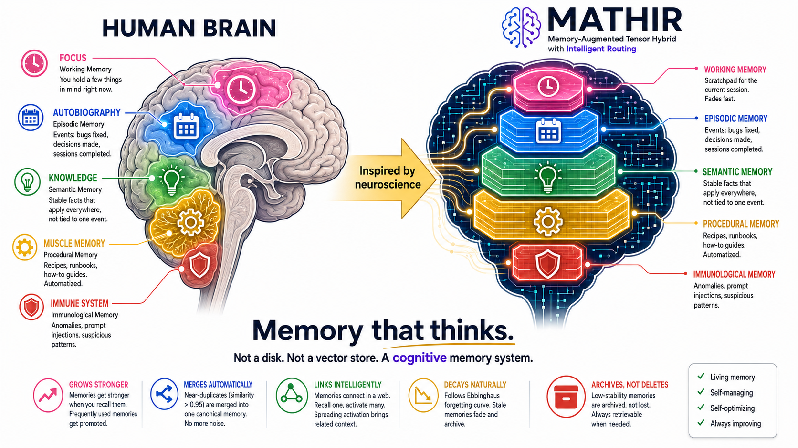
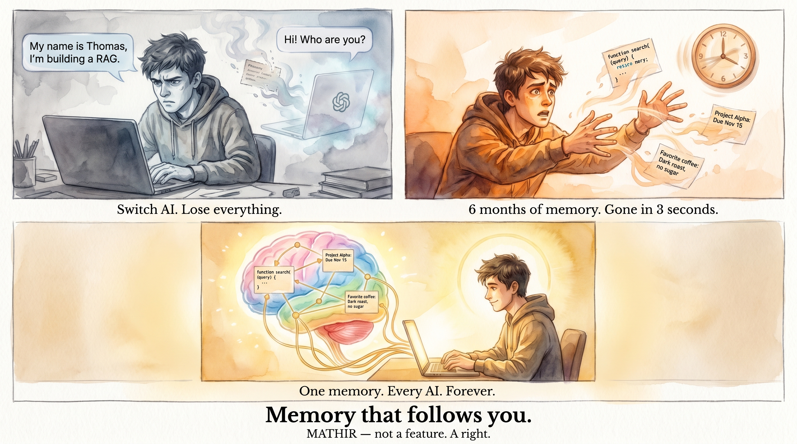

<!-- SEO: meta tags for search engines -->
<!-- mathir,memory-augmented,llm-memory,cognitive-memory,vector-database,ai-agent,rag,mcp,model-context-protocol,knowledge-graph,ai-memory,long-term-memory,open-source,mit,sqlite,local-ai,edge-ai,jetson,raspberry-pi,neuroscience,ebbinghaus,tier-promotion,memory-consolidation,prompt-injection,anomaly-detection,mahalanobis,onnx,sentence-transformers,python,llama,claude,chatgpt,gemini,opencode,cursor,windsurf,kilocode -->

> **⚠️ DISCLAIMER** — MATHIR has NOT undergone formal security testing. Use at your own risk in production. **License:** MIT.

---

<div align="center">


# 🧠 MATHIR

### Memory-Augmented Tensor Hybrid with Intelligent Routing

**The first cognitive memory layer for LLMs that actually thinks — promotes, forgets, consolidates, and links.**

<br/>

> **🆕 v8.5.1** — 23 MCP tools, project-aware DB, `memory_by_path`, `memory_recall_quality`, `memory_incoming_links`, auto-classify. [CHANGELOG](CHANGELOG.md) · [Release notes](#-latest-v851)

<br/>

[](https://www.python.org)
[](https://pytorch.org)
[](LICENSE)
[](CHANGELOG.md)
[](#-tests--benchmarks)

</div>

<br/>



---

## ⚡ Quick Start

```bash
git clone https://github.com/sil3d/MATHIR.git
cd MATHIR/mathir_mcp
pip install -e .
mathir-server &
# Add mathir to your MCP config — 23 tools available.
```

Full install: [mathir_mcp/README.md](mathir_mcp/README.md) · Cold-boot auto-start: [mathir_mcp/bin/](mathir_mcp/bin/)

---

## 🆕 Latest: v8.5.1 (2026-06-29)

23 MCP tools (was 20 in v8.5.0). 5 critical bugs fixed.

**New tools:** `memory_by_path` · `memory_recall_quality` · `memory_incoming_links`
**Bug fixes:** `get_project_db_path` CWD-first · `VecMemory._get_conn` mkdir parent · FastMCP `k: str | int` coercion · daemon port 7338
**Auto-classify:** `block_type="auto"` routes by heuristic

Full diff: [CHANGELOG.md](CHANGELOG.md)

---

## 🧭 Project Origin — 2 years, 1 question

This is the story behind MATHIR. It's also my end-of-study project.

> **Can modern cars navigate an *unknown* environment?**
>
> Not a highway with lane markings. Not a pre-mapped city. A place they've never seen, where the rules change every meter.

A car following pre-programmed rules in a perfect simulation isn't intelligent — it's scripted. True autonomy requires the ability to **learn**, **remember**, and **adapt** across situations it's never seen before.

That's where MATHIR started. An AI can't be intelligent if it can't **remember** — every session starts from zero, that's amnesia, not intelligence.

**Next step:** MATHIR has been validated in software (23 MCP tools, 5-tier architecture, plug-and-play MCP). The next step is to **build a 3D-printed RC car** and test MATHIR as its actual memory layer in a real autonomous-driving scenario.

---

## 🔥 5 real-world problems MATHIR solves

| | Problem | MATHIR solution |
|---|---|---|
| 1 | **Medical AI** — "We've never seen this disease before" | Rare case stored as episodic memory → next patient gets instant recall. The model *learns* from experience. |
| 2 | **Chat sessions** — "Sorry, who are you?" | Context persists across sessions, tools, time. Switch Claude → Gemini → Llama — memory stays. |
| 3 | **Autonomous driving** — "The sensor just died" | Car doesn't just see — it *remembers*. "Last time I was here, speed bump at this GPS." Memory fills sensor gaps. |
| 4 | **Fine-tuning** — "My data is a mess" | MATHIR auto-classifies, dedupes, links. Data ready for fine-tuning *as you add it*. |
| 5 | **Knowledge drift** — "Is this still accurate?" | Memories decay when unused. Old memory fades when API changes. Self-maintaining. |

---

## 🧠 What is MATHIR?

A plug-and-play **5-tier cognitive memory** layer for any LLM:

| Tier | Role | Example |
|---|---|---|
| 🩷 **Working** | Scratchpad (current session) | "Right now" |
| 🩵 **Episodic** | Events | "Last time you asked, the API was at /v2" |
| 🟩 **Semantic** | Stable facts | "Water boils at 100°C" |
| 🟨 **Procedural** | How-to / recipes | "How to deploy: pytest → docker build → aws ecs" |
| 🟥 **Immunological** | Anomaly detection | "Prompt injection detected" |

Memories **decay** when unused (Ebbinghaus), **promote** when recalled, **consolidate** with duplicates, **link** to related concepts. **Same memory** works across Claude / GPT / Gemini / Ollama / any LLM.


Why? See the **[doctoral research paper](docs/01_MASTER_RESEARCH_PAPER.md)** (6 theorems) and the **[vs Alternatives](docs/07_MATHIR_VS_VECTORDB_USE_CASES.md)** doc.

---

## The story that hurts



> Monday morning. You open Claude. You tell it: *"My name is Thomas, I'm building a RAG with Python, FastAPI + Postgres."* Claude says: *"Got it, I'll remember that."*
>
> 3 months later. You switch to Cursor + Llama 3.1. **Llama: "Hi! Who are you?"**
> Everything Claude "remembered"? Gone. Vendor-locked.
>
> 6 months of memory. **Wiped in 3 seconds.** Because your memory doesn't belong to you.

And the autonomous vehicle:

> 2:32 PM. The Tesla learns that a yellow pedestrian marker at a crosswalk = slow down. Pattern stored.
> 2:33 PM. OTA restart. Memory is wiped. **Next time, it won't slow down.**
> 2:35 PM. 80 km/h. Zero detection. Zero alerts. Zero memory.
>
> **A car that doesn't remember = a car that doesn't understand.**

What MATHIR changes:


✅ Memory that follows you everywhere — SQLite local, MIT, zero vendor lock-in.
✅ Memory that improves — +37.8% online learning, not static facts.
✅ Anomaly detected in <1ms — immunological tier, AUC = 1.0.
✅ Runs on edge — 240 MB VRAM, Jetson Orin ✅, Raspberry Pi ⚠️, zero cloud.

---

## 🔌 MCP Plug & Play

Add MATHIR to your AI agent (OpenCode, Claude Code, Cursor, MiMo, etc.):

```jsonc
{
  "mcpServers": {
    "mathir": {
      "command": "mathir-mcp"
    }
  }
}
```

**That's it.** 23 tools (`memory_save`, `memory_recall`, `memory_by_path`, `memory_recall_quality`, `memory_incoming_links`, etc.) — all your agents.

Full MCP config: [mathir_mcp/docs/AGENT.md](mathir_mcp/docs/AGENT.md) (50+ agents).

### Console Scripts (universal, IDE-agnostic)

| Command | What it does |
|---|---|
| `mathir-mcp` | MCP stdio server (23 tools, 2 prompts) |
| `mathir-server` | HTTP unified server (port 7338) |
| `mathir-client` | CLI client: `mathir-client recall "my query"` |
| `mathir-dashboard` | Stats dashboard (port 7420) |
| `mathir-migrate` | One-shot legacy→new schema migration |
| `mathir-brain` | Orchestrator (server + watchdog + proxy) |

Install: `pip install -e ./mathir_mcp`

---

## 📚 Documentation Index

| Doc | Purpose |
|---|---|
| **[mathir_mcp/README.md](mathir_mcp/README.md)** | Install, MCP setup, all 23 tools |
| **[mathir_mcp/docs/AGENT.md](mathir_mcp/docs/AGENT.md)** | Per-agent MCP config (50+ agents) |
| **[mathir_mcp/docs/DAEMON.md](mathir_mcp/docs/DAEMON.md)** | Daemon HTTP API + JSON-RPC protocol |
| **[mathir_mcp/docs/DIMENSIONS.md](mathir_mcp/docs/DIMENSIONS.md)** | Embedding model selection |
| **[mathir_mcp/docs/DASHBOARD_GUIDE.md](mathir_mcp/docs/DASHBOARD_GUIDE.md)** | Stats dashboard setup |
| **[mathir_mcp/docs/GPU_SETUP.md](mathir_mcp/docs/GPU_SETUP.md)** | GPU/ONNX acceleration |
| **[docs/01_MASTER_RESEARCH_PAPER.md](docs/01_MASTER_RESEARCH_PAPER.md)** | Doctoral research paper (6 theorems) |
| **[docs/03_MASTER_QA_GUIDE.md](docs/03_MASTER_QA_GUIDE.md)** | 63 Q&A for defense / evaluation |
| **[docs/07_MATHIR_VS_VECTORDB_USE_CASES.md](docs/07_MATHIR_VS_VECTORDB_USE_CASES.md)** | MATHIR vs FAISS / vector DBs |
| **[CHANGELOG.md](CHANGELOG.md)** | Full version history |
| **[mathir_mcp/GLOBAL_INSTRUCTIONS.md](mathir_mcp/GLOBAL_INSTRUCTIONS.md)** | Universal AI agent instructions |

---

## 🛠️ Install Scripts

Cross-platform: `python mathir_mcp/bin/install_smart.py --autostart-only` (Windows / macOS / Linux).

Manual: see [INSTALL/INSTALL_WINDOWS.md](mathir_mcp/INSTALL/INSTALL_WINDOWS.md) · [INSTALL_LINUX.md](mathir_mcp/INSTALL/INSTALL_LINUX.md) · [INSTALL_MACOS.md](mathir_mcp/INSTALL/INSTALL_MACOS.md).

---

## 🆚 vs Alternatives (2026)

| Product | OSS? | LLM-agnostic? | Edge? | Anomaly detection | Cost |
|---|:---:|:---:|:---:|:---:|---|
| **🧠 MATHIR** | ✅ MIT | ✅ Any | ✅ ~500MB GPU | ✅ AUC=1.0 | **Free** |
| Mem0 | ⚠️ SDK | ✅ | ❌ | ❌ | Free → $249/mo |
| Letta | ✅ Apache 2.0 | ✅ | ⚠️ Heavy | ❌ | Free |
| Zep | ⚠️ | ✅ | ❌ | ❌ | $1,250/yr |
| Cognee | ✅ Apache 2.0 | ✅ | ⚠️ Heavy | ❌ | $35/mo |
| LangMem | ✅ MIT | ✅ | ⚠️ DIY | ❌ | Free |
| GraphRAG | ✅ MIT | ✅ | ⚠️ DIY | ❌ | Free |
| ChatGPT Memory | ❌ | ❌ OpenAI | ❌ | ❌ | $20/mo+ |
| Claude Projects | ❌ | ❌ Anthropic | ❌ | ❌ | $20/mo+ |

Full comparison: [docs/07_MATHIR_VS_VECTORDB_USE_CASES.md](docs/07_MATHIR_VS_VECTORDB_USE_CASES.md)

---

## 📊 Tests & Benchmarks

**226/226 tests pass**. Run yourself:

```bash
pytest mathir_mcp/tests/ -v
pytest mathir_dropin/tests/ -v
```

| Benchmark | Result |
|---|---|
| Micro (500 memories) | 360 mem/s store, 425 ops/s recall, p50=2.29ms |
| decay_all | 599/599 decayed (100% coverage) |
| consolidate | 99 duplicates merged |
| Working memory 2h stress | 7140 switches, 0 contamination, isolation 0.886 |

Full results: [benchmarks/06_results/current/](benchmarks/06_results/current/)

---

## 🏗️ Architecture

```
┌──────────────────────────────────┐
│  Any LLM (Claude, GPT, Gemini)  │
└──────────────┬───────────────────┘
               │ embeddings 384d
               ▼
┌──────────────────────────────────┐
│  MATHIR Daemon (port 7338)        │
│  Flask+Waitress · FastMCP 3.4.2  │
│  HybridSearch auto-scaling        │
│  5 tiers · Ebbinghaus · link graph│
└──────────────┬───────────────────┘
               │
               ▼
        SQLite + sqlite-vec
        (per-project DB)
```

Full architecture: [docs/BRAIN_ARCHITECTURE.md](docs/BRAIN_ARCHITECTURE.md)

---

## 🛠️ Project Structure

```
MATHIR/
├── mathir_mcp/         ← Install this (v8.5.1, 23 MCP tools)
├── benchmarks/         ← Reproducible benchmarks
├── docs/                ← Doctoral paper, QA, architecture
├── examples/            ← Usage examples
├── stress_test/         ← Stress test web UI
├── vision_testing/      ← Vision/audio testing
├── raspberry_jetson/    ← Edge deployment
├── _deprecated/         ← v1-v7 history (do not use)
└── README.md (you are here)
```

---

## 🗺️ Roadmap

✅ **V1–V5** Core architecture + KL router
✅ **V6** LLM-agnostic plugin API
✅ **V7** 8 algorithms + 6 theorems + 9.3× compression
✅ **V7.5** BEIR benchmarks (0.7441 SOTA on SciFact)
✅ **V7.6** Universal Bridge (UNIBRI)
✅ **V7.7** Vision & audio testing
✅ **V7.7.1** SimpleMemory (FTS5) + UI overhaul
✅ **V7.8** GPU embeddings + daemon architecture
✅ **V8.0** Cascade architecture
✅ **V8.5.0** FastMCP rewrite + auto-injection (20 tools)
✅ **V8.5.1** New tools (23 total) + project-aware DB

🔜 **V9** Edge deployment (Jetson / ONNX)
📋 **V10** Open-source release (HuggingFace · PyPI)

---

## 🤝 Contributing

We welcome PRs and security reports. Open an issue or pull request.

---

## 📄 Citation

```bibtex
@software{mathir2026,
  title  = {MATHIR: Memory-Augmented Tensor Hybrid with Intelligent Routing},
  author = {Mbama Kombila, Prince Gildas},
  year   = {2026},
  url    = {https://github.com/sil3d/MATHIR}
}
```

Full paper: [docs/MATHIR_Research_Paper.tex](docs/MATHIR_Research_Paper.tex)

---

## 📜 License

[MIT](LICENSE) — free for commercial and research use.
