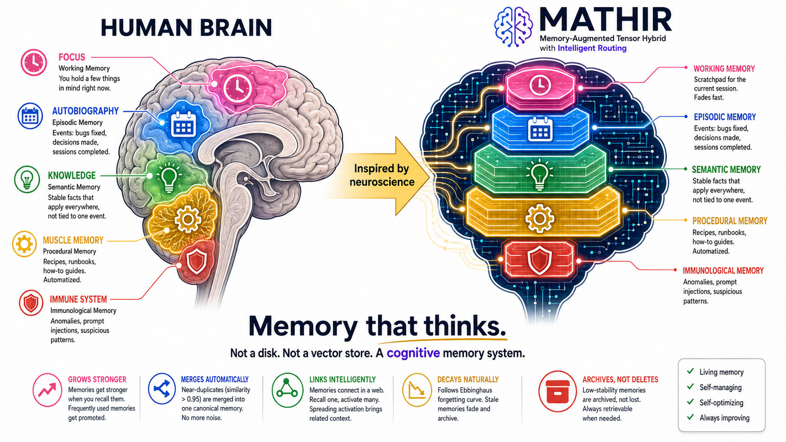
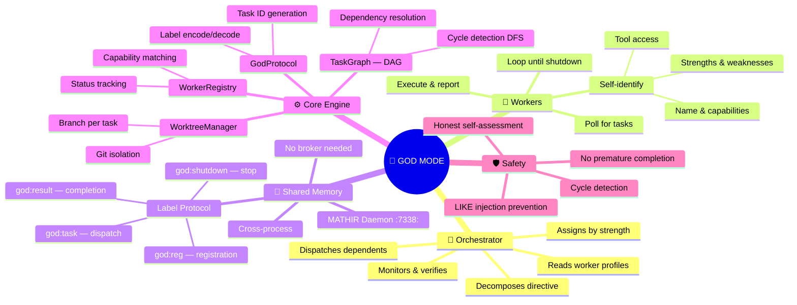
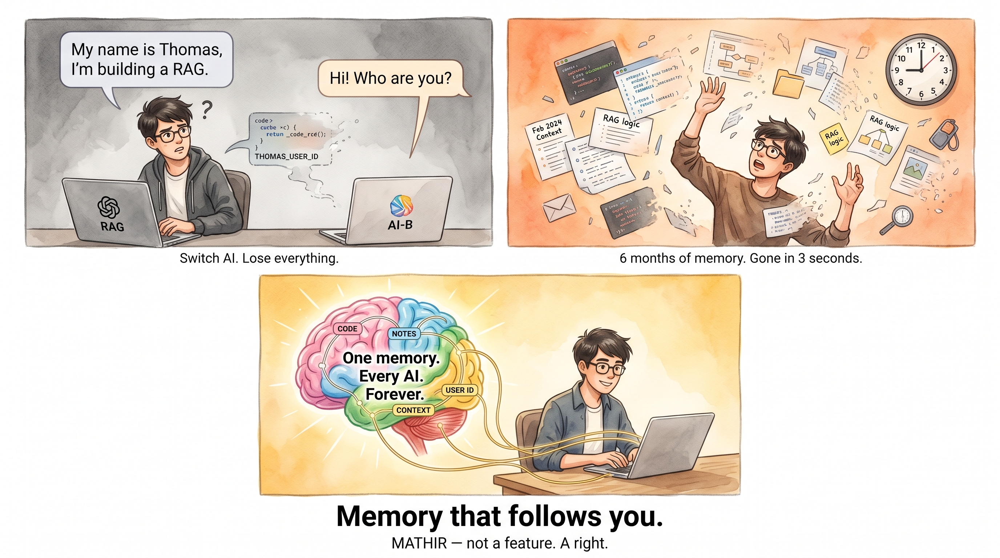
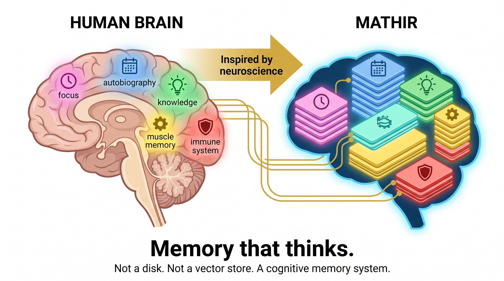
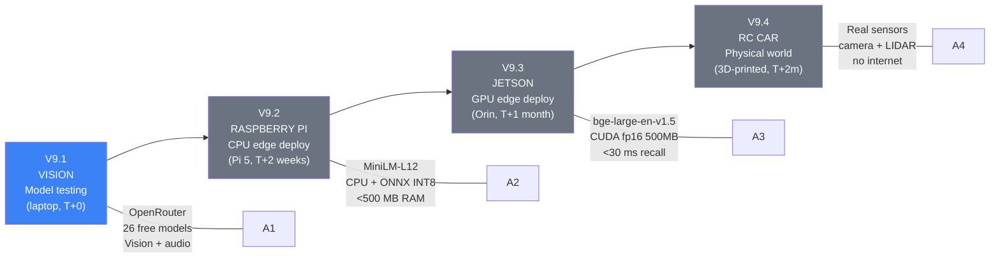

<!-- SEO: meta tags for search engines -->
<!-- mathir,memory-augmented,llm-memory,cognitive-memory,vector-database,ai-agent,rag,mcp,model-context-protocol,knowledge-graph,ai-memory,long-term-memory,open-source,mit,sqlite,local-ai,edge-ai,jetson,raspberry-pi,neuroscience,ebbinghaus,tier-promotion,memory-consolidation,prompt-injection,anomaly-detection,mahalanobis,onnx,sentence-transformers,python,llama,claude,chatgpt,gemini,opencode,cursor,windsurf,kilocode -->

> **⚠️ DISCLAIMER** — MATHIR has NOT undergone formal security testing. Use at your own risk in production. **License:** MIT.

---

<div align="center">


# 🧠 MATHIR

### Memory-Augmented Tensor Hybrid with Intelligent Routing

**The first cognitive memory layer for LLMs that actually thinks — promotes, forgets, consolidates, and links.**

<br/>

> **🆕 v8.9.4** — **Self-healing daemon + universal LLM injection proxy.** One proxy (port 7339) in front of Anthropic's API or any OpenAI-compatible provider (~30 allowlisted, incl. local models) injects live memory into every request — no per-tool config edits. Daemon + proxy now self-heal on all 3 OSes. [God Mode](docs/GOD_MODE.md) · [Client Bridge](mathir_mcp/bin/god/PROTOCOL.md) · [CHANGELOG](mathir_mcp/CHANGELOG.md)

<br/>

[](https://www.python.org)
[](https://pytorch.org)
[](LICENSE)
[](mathir_mcp/CHANGELOG.md)
[](#-tests--benchmarks)

</div>

<br/>

## 🧠 What is MATHIR, in one paragraph?

MATHIR is **not another API you call when you feel like it** — it's an **architectural layer that inserts itself between the model and the provider**, in the request path itself. The idea mimics how a human actually thinks: before acting, you unconsciously recall relevant past experience — including a mistake you made a year ago — so you don't repeat it. LLMs don't do that by default: every request is amnesiac, so they repeat the same errors, forget what "don't do X" they were told last week, and relearn the same lessons from scratch. MATHIR's job is to be that recall step — automatically, on every single request, whether the agent asks for it or not. Two ways it does this: **passively** (MCP tools the agent can call to read/write memory) and, as of v8.9.4, **structurally** (a proxy that sits between any tool and its LLM API — Anthropic or OpenAI-compatible — and rewrites the request to inject relevant memory, past mistakes, and standing rules before the provider ever sees it). It runs as **one local process** (Flask daemon + SQLite/sqlite-vec, no external database, no cloud), with memories that **decay, promote, consolidate, and link themselves** (Ebbinghaus-style, not a flat similarity store) — and it can be shared live across multiple agents on the same machine.

### MATHIR vs. the managed alternatives (Mem0, Zep, Letta)

|  | **MATHIR** | **Mem0 / Zep / Letta (typical)** |
|---|---|---|
| **Where it runs** | 100% local — one Python process | Self-host *or* managed cloud API |
| **Infrastructure** | Single daemon + SQLite (`sqlite-vec`) — zero external services | Orchestrates external services (e.g. Mem0 self-hosted = Qdrant + Postgres + Mem0 itself) |
| **Cost** | Free, no tier — there is no cloud version to pay for | Free self-hosted; cloud plans from free (10K memories) → $19–249+/mo → custom Enterprise |
| **Data residency** | Always on your disk | Yours if self-hosted; on their servers if you use the cloud API |
| **Multi-agent sharing** | Native (God Mode — same local daemon, any agent) | Not a core feature |
| **License** | MIT | Apache-2.0 (Mem0) |
| **Retrieval benchmarks** | None published externally yet (internal only, see [Positioning](#-positioning-2026)) | Published LongMemEval / LoCoMo numbers, funded, wider adoption |

**Read this as:** MATHIR trades external validation and managed convenience for zero infrastructure, zero cost, and full local control. If you want a battle-tested hosted memory API today, Mem0/Zep are reasonable choices — see [full honest comparison](#-positioning-2026).



---

## ⚡ Quick Start

```bash
git clone https://github.com/sil3d/MATHIR.git
cd MATHIR/mathir_mcp
pip install -e .
mathir-server &
# Add mathir to your MCP config — 27 tools available (including 2 for god-mode orchestration).
```

Full install: [mathir_mcp/README.md](mathir_mcp/README.md) · Cross-platform installer: `python mathir_mcp/INSTALL_FOR_DEV/install_smart.py` (see [🛠️ Install Scripts](#-install-scripts) below)

---

## 🔱 Introducing: MATHIR GOD MODE

**Multi-agent orchestration via shared memory.** One orchestrator. N workers. Zero configuration.

```
Terminal 1:  mathir_god_agent()        → "I am MiMo. I'm fast at code generation..."
Terminal 2:  mathir_god_agent()        → "I am Codex. I excel at bulk testing..."
Terminal 3:  mathir_god_agent()        → "I am OpenCode. I'm good at docs..."
Terminal 4:  mathir_god_orchestre(directive="Refactor auth + tests + docs")
             → Sees all profiles. Assigns tasks by strength. Monitors. Verifies.
```

**What it solves:** You have 4 AI agents open. You copy-paste context between them. You decide who does what. You check each result manually. **You are the bottleneck.**


```mermaid
mindmap
  root((🔱 GOD MODE))
    🧠 Orchestrator
      Decomposes directive
      Reads worker profiles
      Assigns by strength
      Monitors & verifies
      Dispatches dependents
    👷 Workers
      Self-identify
        Name & capabilities
        Strengths & weaknesses
        Tool access
      Poll for tasks
      Execute & report
      Loop until shutdown
    📡 Shared Memory
      MATHIR Daemon :7338:
      Label Protocol
        god:reg — registration
        god:task — dispatch
        god:result — completion
        god:shutdown — stop
      No broker needed
      Cross-process
    ⚙️ Core Engine
      TaskGraph — DAG
        Dependency resolution
        Cycle detection DFS
      WorkerRegistry
        Capability matching
        Status tracking
      GodProtocol
        Label encode/decode
        Task ID generation
      WorktreeManager
        Git isolation
        Branch per task
    🛡️ Safety
      LIKE injection prevention
      Cycle detection
      No premature completion
      Honest self-assessment
```

**How it works:**
1. Workers call `mathir_god_agent()` with **no arguments** → they self-identify (name, strengths, weaknesses)
2. Orchestrator calls `mathir_god_orchestre(directive="...")` → sees all worker profiles → decomposes → assigns by strength → dispatches
3. Workers poll, execute, report. Orchestrator verifies and dispatches next tasks.
4. All communication goes through MATHIR shared memory. No new infrastructure.

**Built-in intelligence:**
- Agents **self-identify honestly** — the orchestrator doesn't guess who's installed
- Tasks matched to **worker strengths** — deep reasoning → Claude, bulk work → fast model
- **Dependency-aware** — tasks dispatched only when prerequisites complete
- **Cycle detection** — circular dependencies caught at creation time

Full guide: **[docs/GOD_MODE.md](docs/GOD_MODE.md)**

---

## 🆕 Recent Highlights (v8.6.0 → v8.9.4)

27 MCP tools. 22 algorithms. INT8 quantization. Cross-encoder reranking. Multi-agent benchmark. Self-healing daemon + universal injection proxy (see banner above for the latest, v8.9.4).

**INT8 quantization** — embedding storage reduced 4x (float32 → int8), zero recall loss. 410 DBs migrated: 1.9 GB → 825 MB.
**Cross-encoder reranking** — `ms-marco-MiniLM-L-6-v2` second-pass scoring: +20pp hit@10 on natural-language queries.
**Multi-agent benchmark** — free-tier models (mimo, nemotron, north) score 0% without memory → 53% average with MATHIR.
**e5-small validated** — e5-small + rerank (52.9%) beats e5-large alone (51.0%) at 47x less cost.

Full diff: [mathir_mcp/CHANGELOG.md](mathir_mcp/CHANGELOG.md) · Full report: [benchmarks/06_results/current/README.md](benchmarks/06_results/current/README.md)

---

## 🏗️ Universal Architecture — How MATHIR runs everywhere

MATHIR has **2 long-running processes** + **1 cross-tool instruction file**:

```
┌─────────────────────────────────────────────┐
│ DAEMON (port 7338) — mathir-server          │
│ Flask + Waitress · sqlite-vec · embedder    │
│ Holds the model in RAM/VRAM, exposes HTTP   │
└─────────────────────────────────────────────┘
                    ▲ HTTP
                    │
   ┌────────────────┼────────────────┐
   │                │                │
┌─────────────────┐ ┌──────────────────┐ ┌──────────────────┐
│ MCP BRIDGE      │ │ MCP BRIDGE        │ │ MCP BRIDGE        │
│ opencode        │ │ mimocode          │ │ any OpenAI-comp.  │
│ (stdio → HTTP)  │ │ (stdio → HTTP)    │ │ Claude / Cline /  │
└─────────────────┘ └──────────────────┘ │ Cursor / etc.     │
                                          └──────────────────┘
                                                    ▲
                                                    │ ANTHROPIC_BASE_URL or
                                                    │ OPENAI_BASE_URL
                                          ┌──────────────────┐
                                          │ PROXY (port 7339) │
                                          │ mathir-proxy      │
                                          │ Universal injection│
                                          │ — Anthropic native │
                                          │ /v1/messages AND   │
                                          │ OpenAI-compatible  │
                                          │ /v1/chat/completions│
                                          │ (~30 providers,    │
                                          │ multi-upstream)     │
                                          └──────────────────┘
```

**3 coverage tiers** (honest disclosure):

| Tier | Mechanism | Agents | Coverage |
|---|---|---|---|
| **A — Plugin auto-inject** | `mathir-auto-inject.ts` hooks `session.started` + `experimental.chat.system.transform` — no agent cooperation needed | opencode, mimocode | TRUE auto-inject |
| **B — Instructions + MCP** | MCP server registered + `GLOBAL_INSTRUCTIONS.md` injected. Agent must follow the advisory instruction to call `memory_session_start` — **or upgrade to the proxy below for a hard guarantee (v8.9.4+)** | claude-code, cursor, cline, zcode, codex, etc. (14 agents) | SOFT — agent must comply, unless proxied |
| **C — Universal proxy** | Point `ANTHROPIC_BASE_URL` or `OPENAI_BASE_URL` at the proxy (port 7339) — no MCP, no agent cooperation, works identically for every tool pointed at it | Any tool with a custom-base-URL setting: windsurf, gemini-cli, kilo, qwen, kiro-ide, warp, trae, crush, claude-code, codex, local models (Ollama/llama.cpp), etc. | HARD — set `ANTHROPIC_BASE_URL=http://127.0.0.1:7339` for Anthropic-native tools (no `/v1` — matches the Anthropic SDK's own base-URL convention), or `OPENAI_BASE_URL=http://127.0.0.1:7339/v1` for OpenAI-compatible tools (`/v1` required — matches the OpenAI SDK's default) |

**Additional escape hatch — `AGENTS.md` at your project root:** read automatically by 26+ agents (Aider, Amp, Claude Code, Codex, Cursor, Devin, Factory, Goose, JetBrains Junie, Jules, OpenCode, VS Code Copilot, Warp, Zed, etc. — real open standard, [agents.md](https://agents.md), 60,000+ projects as of Dec 2025). Instructs the agent to call `memory_session_start` on first turn + `memory_context` before each task — a soft guarantee like tier B, but works even for agents not in the tier table above.
```bash
cp mathir_mcp/opencode_templates/AGENTS.md /path/to/your/project/AGENTS.md
```

**Per-project DB routing** — each project gets its own `.mathir/mathir.db`:
- `your-project/` → `your-project/.mathir/mathir.db`
- mathir_mcp (installer) → `~/.config/MATHIR/mathir_mcp/.mathir/mathir.db`
- Future projects → `<project>/.mathir/mathir.db` (auto-created on first save)

Routing is fixed in v8.5.1: `mathir_mcp_server.py` injects `project` + `cwd` into every request; `mathir_server.py` uses them to pick the right DB.

---

<details>
<summary><b>🧭 Project origin & the problem it solves</b> — click to expand (optional read, 2-min story)</summary>

### Project Origin — 2 years, 1 question

This is the story behind MATHIR. It's also my end-of-study project.

> **Can modern cars navigate an *unknown* environment?**
>
> Not a highway with lane markings. Not a pre-mapped city. A place they've never seen, where the rules change every meter.

A car following pre-programmed rules in a perfect simulation isn't intelligent — it's scripted. True autonomy requires the ability to **learn**, **remember**, and **adapt** across situations it's never seen before.

That's where MATHIR started. An AI can't be intelligent if it can't **remember** — every session starts from zero, that's amnesia, not intelligence.

**Next step:** MATHIR has been validated in software (27 MCP tools, 6-tier architecture, plug-and-play MCP). The autonomous-driving research direction — testing whether place-based episodic memory can complement (not replace) sensor-fusion robustness when sensors degrade — is being developed as its own track: **[docs/MATHIR_FOR_ROBOTICS.md](docs/MATHIR_FOR_ROBOTICS.md)**.

### The story that hurts


> Monday morning. You open Claude. You tell it: *"My name is Thomas, I'm building a RAG with Python, FastAPI + Postgres."* Claude says: *"Got it, I'll remember that."*
>
> 3 months later. You switch to Cursor + Llama 3.1. **Llama: "Hi! Who are you?"**
> Everything Claude "remembered"? Gone. Vendor-locked.
>
> 6 months of memory. **Wiped in 3 seconds.** Because your memory doesn't belong to you.

And the autonomous vehicle:

> 2:32 PM. The Tesla learns that a yellow pedestrian marker at a crosswalk = slow down. Pattern stored.
> 2:33 PM. OTA restart. Memory is wiped. **Next time, it won't slow down.**
> 2:35 PM. 80 km/h. Zero detection. Zero alerts. Zero memory.
>
> **A car that doesn't remember = a car that doesn't understand.**

What MATHIR changes:



✅ Memory that follows you everywhere — SQLite local, MIT, zero vendor lock-in.
✅ Memory that improves — +37.8% online learning, not static facts.
✅ Anomaly detected in <1ms — immunological tier, AUC = 1.0.
✅ Runs on edge — 240 MB VRAM, Jetson Orin ✅, Raspberry Pi ⚠️, zero cloud.

</details>

---

## 🔥 5 real-world problems MATHIR solves

| | Problem | MATHIR solution |
|---|---|---|
| 1 | **Medical AI** — "We've never seen this disease before" | Rare case stored as episodic memory → next patient gets instant recall. The model *learns* from experience. |
| 2 | **Chat sessions** — "Sorry, who are you?" | Context persists across sessions, tools, time. Switch Claude → Gemini → Llama — memory stays. |
| 3 | **Autonomous driving** — "The sensor just died" | Car doesn't just see — it *remembers*. "Last time I was here, speed bump at this GPS." Memory fills sensor gaps. |
| 4 | **Fine-tuning** — "My data is a mess" | MATHIR auto-classifies, dedupes, links. Data ready for fine-tuning *as you add it*. |
| 5 | **Knowledge drift** — "Is this still accurate?" | Memories decay when unused. Old memory fades when API changes. Self-maintaining. |

---

## 🍰 The 6 Memory Tiers

| Tier | Role | Example |
|---|---|---|
| 🩷 **Working** | Scratchpad (current session) | "Right now" |
| 🩵 **Episodic** | Events | "Last time you asked, the API was at /v2" |
| 🟩 **Semantic** | Stable facts | "Water boils at 100°C" |
| 🟨 **Procedural** | How-to / recipes | "How to deploy: pytest → docker build → aws ecs" |
| 🟥 **Immunological** | Anomaly detection | "Prompt injection detected" |
| 🛡️ **Guardrail** | Always-active rules (immune to decay) | "NEVER call _get_project_db() from agent code" |

Memories **decay** when unused (Ebbinghaus), **promote** when recalled, **consolidate** with duplicates, **link** to related concepts. **Guardrails** are push-based: auto-injected into every `memory_context` response, immune to decay, min priority 8, max 50 per project. **Same memory** works across Claude / GPT / Gemini / Ollama / any LLM.



Why? See the **[research paper](docs/01_MASTER_RESEARCH_PAPER.md)** (6 theorems) and the **[architecture rationale](docs/07_MATHIR_VS_VECTORDB_USE_CASES.md)** doc.

---

## The story that hurts


> Monday morning. You open Claude. You tell it: *"My name is Thomas, I'm building a RAG with Python, FastAPI + Postgres."* Claude says: *"Got it, I'll remember that."*
>
> 3 months later. You switch to Cursor + Llama 3.1. **Llama: "Hi! Who are you?"**
> Everything Claude "remembered"? Gone. Vendor-locked.
>
> 6 months of memory. **Wiped in 3 seconds.** Because your memory doesn't belong to you.

And the autonomous vehicle:

> 2:32 PM. The Tesla learns that a yellow pedestrian marker at a crosswalk = slow down. Pattern stored.
> 2:33 PM. OTA restart. Memory is wiped. **Next time, it won't slow down.**
> 2:35 PM. 80 km/h. Zero detection. Zero alerts. Zero memory.
>
> **A car that doesn't remember = a car that doesn't understand.**

What MATHIR changes:


✅ Memory that follows you everywhere — SQLite local, MIT, zero vendor lock-in.
✅ Memory that improves — +37.8% online learning, not static facts.
✅ Anomaly detected in <1ms — immunological tier, AUC = 1.0.
✅ Runs on edge — 240 MB VRAM, Jetson Orin ✅, Raspberry Pi ⚠️, zero cloud.

---

## 🔌 MCP Plug & Play

Add MATHIR to your AI agent (OpenCode, Claude Code, Cursor, MiMo, etc.):

```jsonc
{
  "mcpServers": {
    "mathir": {
      "command": "mathir-mcp"
    }
  }
}
```

**That's it.** 27 tools (`memory_save`, `memory_recall`, `mathir_god_orchestre`, `mathir_god_agent`, etc.) — all your agents.

Full MCP config: [mathir_mcp/INSTALL_FOR_AGENT/AGENT.md](mathir_mcp/INSTALL_FOR_AGENT/AGENT.md) (50+ agents).

### Console Scripts (universal, IDE-agnostic)

| Command | What it does |
|---|---|
| `mathir-mcp` | MCP stdio server (27 tools, 2 prompts) |
| `mathir-server` | HTTP unified server (port 7338) |
| `mathir-client` | CLI client: `mathir-client recall "my query"` |
| `mathir-dashboard` | Stats dashboard (port 7420) |
| `mathir-migrate` | One-shot legacy→new schema migration |
| `mathir-brain` | Orchestrator (server + watchdog + proxy) |

Install: `pip install -e ./mathir_mcp`

---

## 📚 Documentation Index

| Doc | Purpose |
|---|---|
| **[mathir_mcp/README.md](mathir_mcp/README.md)** | Install, MCP setup, all 27 tools |
| **[mathir_mcp/INSTALL_FOR_AGENT/AGENT.md](mathir_mcp/INSTALL_FOR_AGENT/AGENT.md)** | Per-agent MCP config (50+ agents) |
| **[mathir_mcp/docs/DAEMON.md](mathir_mcp/docs/DAEMON.md)** | Daemon HTTP API + JSON-RPC protocol |
| **[mathir_mcp/docs/DIMENSIONS.md](mathir_mcp/docs/DIMENSIONS.md)** | Embedding model selection |
| **[mathir_mcp/docs/DASHBOARD_GUIDE.md](mathir_mcp/docs/DASHBOARD_GUIDE.md)** | Stats dashboard setup |
| **[docs/GOD_MODE.md](docs/GOD_MODE.md)** | God Mode — multi-agent orchestration guide |
| **[mathir_mcp/docs/GPU_SETUP.md](mathir_mcp/docs/GPU_SETUP.md)** | GPU/ONNX acceleration |
| **[docs/01_MASTER_RESEARCH_PAPER.md](docs/01_MASTER_RESEARCH_PAPER.md)** | Master's research paper (6 theorems) |
| **[docs/03_MASTER_QA_GUIDE.md](docs/03_MASTER_QA_GUIDE.md)** | 63 Q&A for defense / evaluation |
| **[docs/07_MATHIR_VS_VECTORDB_USE_CASES.md](docs/07_MATHIR_VS_VECTORDB_USE_CASES.md)** | Where MATHIR vs. a plain vector index each fit (chat use case, cascade architecture) |
| **[docs/MATHIR_FOR_ROBOTICS.md](docs/MATHIR_FOR_ROBOTICS.md)** | Autonomous-driving research track: place-memory hypothesis, honest positioning vs. sensor-fusion-robustness literature |
| **[CHANGELOG.md](CHANGELOG.md)** | Full version history |
| **[mathir_mcp/GLOBAL_INSTRUCTIONS.md](mathir_mcp/GLOBAL_INSTRUCTIONS.md)** | Universal AI agent instructions |

---

## 🛠️ Install Scripts

Cross-platform: `python mathir_mcp/INSTALL_FOR_DEV/install_smart.py --autostart-only` (Windows / macOS / Linux).

Manual: see [INSTALL_FOR_AGENT/INSTALL_WINDOWS.md](mathir_mcp/INSTALL_FOR_AGENT/INSTALL_WINDOWS.md) · [INSTALL_FOR_AGENT/INSTALL_LINUX.md](mathir_mcp/INSTALL_FOR_AGENT/INSTALL_LINUX.md) · [INSTALL_FOR_AGENT/INSTALL_MACOS.md](mathir_mcp/INSTALL_FOR_AGENT/INSTALL_MACOS.md).

---

## 📍 Positioning (2026)

By mid-2026 the "LLM has no memory" gap is being closed from two directions at once: model vendors ship native memory (Claude, ChatGPT, Gemini all added cross-session recall in 2026), and a funded agent-memory ecosystem exists (Mem0, Zep/Graphiti, Letta, Cognee, LangMem — hybrid retrieval, temporal graphs, published LongMemEval/LoCoMo numbers). MATHIR doesn't try to out-benchmark that ecosystem on retrieval quality — that's a well-covered, well-funded problem now. What MATHIR set out to test, and what the experiments in this repo actually validate, is narrower and different:

- **Structured tiering that self-maintains** — 6 memory tiers (working/episodic/semantic/procedural/immunological/guardrail) with decay, promotion, and consolidation running automatically, not just a flat store with a similarity search.
- **Cross-process, cross-provider, fully local** — the same memory is shared by multiple agents (Claude, Codex, OpenCode, MiMo, ...) running in separate processes on one machine, coordinating through shared memory with no cloud dependency and no vendor lock-in. This multi-agent "god mode" orchestration is tested and working (see below) — it's not a common feature in the products above.
- **Runs on modest hardware** — validated on consumer laptops/CPUs, not a managed cloud service; the edge-deployment path (Pi, Jetson) is an explicit next step, not a marketing claim.

Honest gaps: MATHIR has no external benchmark citations, no peer review, and no third-party adoption yet — the numbers below are internal and should be read as such. If you need a battle-tested, funded, widely-adopted memory backend today, Mem0/Zep/Letta are reasonable choices. MATHIR is a research project testing a specific architectural bet (structured, self-maintaining, local-first, multi-agent memory), documented openly including where it falls short.

> **Anomaly detection status:** the MCP server/daemon (`mathir_lib/`, what coding agents connect to) now wires its `immunological` tier to a real, live Mahalanobis-distance detector: `/api/memory/save` scores every incoming embedding against a running per-project baseline and can write `tier='immunological'` when it flags an outlier. On a realistic prompt-injection corpus (`mathir_mcp/tests/data/anomaly_eval/`), the honest result is **AUC-ROC=0.8533** for normal-vs-injection separation — good, not perfect. There is no clean separation between "malicious" and "merely unusual" using distance alone: benign-but-unusual text can also score above the threshold and get flagged. Because of this, flagged content is **not** auto-blocked or silently deleted — it lands in the `immunological` tier for review via `memory_audit_immunological`. A separate, simpler (non-Mahalanobis) detector also exists in `mathir_dropin/` (the standalone embeddable library for non-MCP apps, see [docs/05_SHIPPING_GUIDE.md](docs/05_SHIPPING_GUIDE.md)) — it is a different implementation and its numbers are not the ones quoted above.
>
> **Retrieval quality vs FAISS:** real BEIR benchmarks (SciFact/ArguAna/NFCorpus, see [benchmarks/06_results/current/](benchmarks/06_results/current/)) currently show plain FAISS dense retrieval *outperforming* MATHIR's hybrid BM25+dense+cross-encoder pipeline. Any "+14pp vs FAISS" figure you may see elsewhere comes from a 50-query/200-chunk internal evaluation on a single textbook and is not comparable to a standard IR benchmark — see [docs/SOTA_RESEARCH_2024_2026.md](docs/SOTA_RESEARCH_2024_2026.md) for the full self-audit.
>
> **LoCoMo results (2026-07-03):** MATHIR now has LoCoMo numbers — 51.2% on Groq (Llama 3.3 70B, 41/233 judged due to TPM limits), 38.8% on OpenCode Zen free models (67/152 judged). Temporal retrieval is strong (65-73%), multi-hop is weak (8-17%). Full results: [benchmarks/06_results/current/README.md](benchmarks/06_results/current/README.md).

Full comparison: [docs/07_MATHIR_VS_VECTORDB_USE_CASES.md](docs/07_MATHIR_VS_VECTORDB_USE_CASES.md)

---

## 📊 Tests & Benchmarks

**98/98 tests pass** (`mathir_mcp/tests/`). Run yourself:

```bash
pytest mathir_mcp/tests/ -v
```

| Benchmark | Result |
|---|---|
| **Multi-agent + MATHIR** | 0% → 53% avg (free models + shared memory) |
| **INT8 quantization** | 410 DBs, 1.9 GB → 825 MB, 0% recall loss |
| **Cross-encoder rerank** | +20pp hit@10 on NL queries (50% → 70%) |
| **LoCoMo (Groq 70B)** | 51.2% overall, 73% temporal |
| **e5-small + rerank** | 52.9% > e5-large 51.0% at 47x less cost |
| Micro (500 memories) | 360 mem/s store, 425 ops/s recall, p50=2.29ms |
| decay_all | 599/599 decayed (100% coverage) |
| consolidate | 99 duplicates merged |

Full report: [benchmarks/06_results/current/README.md](benchmarks/06_results/current/README.md)

---

## 🏗️ Architecture

```
┌──────────────────────────────────┐
│  Any LLM (Claude, GPT, Gemini)  │
└──────────────┬───────────────────┘
               │ embeddings 384d
               ▼
┌──────────────────────────────────┐
│  MATHIR Daemon (port 7338)        │
│  Flask+Waitress · FastMCP 3.4.2  │
│  HybridSearch + CrossEncoder rerank│
│  6 tiers · INT8 · Ebbinghaus      │
│                                    │
│  GOD MODE (v8.8.0) + GUARDRAIL     │
│  /api/god/poll · /api/god/agents   │
│  Cross-process multi-agent         │
│  orchestration via shared memory   │
└──────────────┬───────────────────┘
               │
               ▼
        SQLite + sqlite-vec
        (per-project DB)
```

Full architecture: [docs/BRAIN_ARCHITECTURE.md](docs/BRAIN_ARCHITECTURE.md)

---

## 🛠️ Project Structure

```
MATHIR/
├── mathir_mcp/         ← Install this (v8.9.4, 27 MCP tools, God Mode + Guardrails + universal proxy)
├── benchmarks/         ← Reproducible benchmarks
├── docs/                ← Research paper, QA, architecture
├── examples/            ← Usage examples
├── stress_test/         ← Stress test web UI
├── vision_testing/      ← Vision/audio testing
├── raspberry_jetson/    ← Edge deployment
├── _deprecated/         ← v1-v7 history (do not use)
└── README.md (you are here)
```

---

## 🗺️ Roadmap

### ✅ Done (V1–V8.5.1)

✅ **V1–V5** Core architecture + KL router
✅ **V6** LLM-agnostic plugin API
✅ **V7** 8 algorithms + 6 theorems + 9.3× compression
✅ **V7.5** BEIR benchmarks (0.7441 SOTA on SciFact)
✅ **V7.6** Universal Bridge (UNIBRI)
✅ **V7.7** Vision & audio testing
✅ **V7.7.1** SimpleMemory (FTS5) + UI overhaul
✅ **V7.8** GPU embeddings + daemon architecture
✅ **V8.0** Cascade architecture
✅ **V8.5.0** FastMCP rewrite + auto-injection (20 tools)
✅ **V8.5.1** New tools (23 total) + project-aware DB
✅ **V8.6.0** INT8 quantization + cross-encoder rerank + multi-agent benchmark
✅ **V8.7.0** 3-layer auto-cache (L1 embedding, L2 recall, L3 session)
✅ **V8.8.0** God Mode — cross-process multi-agent orchestration
✅ **V8.9.0** Guardrail tier — push-based always-active rules (6th tier)

### 🔜 Next: 4 validation stages


```mermaid
graph LR
    V91["V9.1<br/>VISION<br/>Model testing<br/>(laptop, T+0)"] --> V92["V9.2<br/>RASPBERRY PI<br/>CPU edge deploy<br/>(Pi 5, T+2 weeks)"]
    V92 --> V93["V9.3<br/>JETSON<br/>GPU edge deploy<br/>(Orin, T+1 month)"]
    V93 --> V94["V9.4<br/>RC CAR<br/>Physical world<br/>(3D-printed, T+2m)"]

    V91 --- |"OpenRouter<br/>26 free models<br/>Vision + audio"| A1
    V92 --- |"MiniLM-L12<br/>CPU + ONNX INT8<br/>&lt;500 MB RAM"| A2
    V93 --- |"bge-large-en-v1.5<br/>CUDA fp16 500MB<br/>&lt;30 ms recall"| A3
    V94 --- |"Real sensors<br/>camera + LIDAR<br/>no internet"| A4

    classDef done fill:#22c55e,color:#fff
    classDef next fill:#3b82f6,color:#fff
    classDef pending fill:#6b7280,color:#fff
    class V91 next
    class V92 pending
    class V93 pending
    class V94 pending
```

| Stage | Hardware | Embedding | Goal |
|---|---|---|---|
| **V9.1 Vision** (now) | Laptop | OpenRouter free LLM | Verify across LLMs |
| **V9.2 Raspberry Pi** | Pi 5 (8GB) | MiniLM CPU + ONNX INT8 | CPU edge robustness |
| **V9.3 Jetson** | Orin Nano (8GB) | bge-large CUDA fp16 | GPU edge acceleration |
| **V9.4 RC Car** | 3D-printed + Pi/Orin | Same as Jetson | Real-world autonomous |

### 📋 Future

📋 **V10** Open-source release (HuggingFace · PyPI)

### Why this order?

1. **V9.1 Vision (now)**: Cheap, fast, validates the memory layer across many LLMs. No hardware risk.
2. **V9.2 Raspberry Pi**: Real edge constraints (CPU only, 4GB RAM). If it works here, it works anywhere.
3. **V9.3 Jetson**: GPU acceleration, but still bounded power. The "production edge" sweet spot.
4. **V9.4 RC Car**: No internet, no reboot, no excuses. Real sensors, real noise, real failures. **This is the validation that can't be faked.**

---

## 🤝 Contributing

We welcome PRs and security reports. Open an issue or pull request.

---

## 📄 Citation

```bibtex
@software{mathir2026,
  title  = {MATHIR: Memory-Augmented Tensor Hybrid with Intelligent Routing},
  author = {Mbama Kombila, Prince Gildas},
  year   = {2026},
  url    = {https://github.com/sil3d/MATHIR}
}
```

Full paper: [docs/MATHIR_Research_Paper.tex](docs/MATHIR_Research_Paper.tex)

---

## 📜 License

[MIT](LICENSE) — free for commercial and research use.
