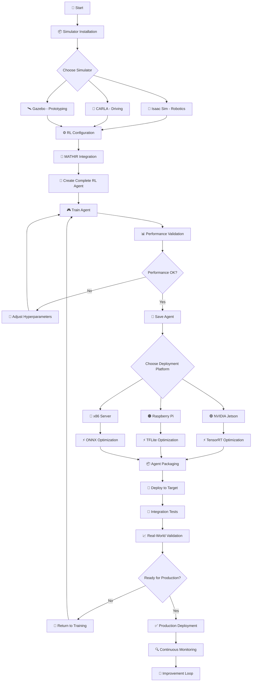

# **Practical Guide: Deployment and Training of RL Agents with MATHIR Memory Module**

## **📋 Table of Contents**
1. [Clarification: MATHIR as a Memory Module](#clarification-mathir)
2. [Hardware Requirements](#hardware-requirements)
3. [Installation and Configuration of Simulators](#simulator-installation)
4. [Integration of MATHIR into an RL Agent](#rl-integration)
5. [Optimization for Embedded Hardware](#embedded-optimization)
6. [Deployment on Edge Targets](#edge-deployment)
7. [Key Configuration Parameters](#configuration-parameters)
8. [Complete Workflow](#complete-workflow)
9. [Troubleshooting Common Issues](#troubleshooting)

## **🧠 1. Clarification: MATHIR as a Memory Module** {#clarification-mathir}

### **MATHIR is not an Autonomous Agent**
MATHIR (Memory-Augmented Transformer with Hierarchical Retention) is a **hierarchical memory module** that integrates into RL agents, not a complete autonomous agent itself.

```python
# ❌ WRONG DESIGN (avoid)
agent = MATHIRv5()  # WRONG: MATHIR alone cannot make decisions

# ✅ CORRECT DESIGN
class AutonomousAgent:
    def __init__(self):
        self.perception = PerceptionNetwork()  # Vision Module
        self.memory = MATHIRv5()              # Memory Module
        self.policy = PPOPolicy()             # RL Decision Module
        self.critic = ValueNetwork()          # Evaluation Module
        
    def act(self, observation):
        features = self.perception(observation)   # 1. Perception
        context = self.memory.retrieve(features)  # 2. Memory Recall
        action = self.policy(features, context)   # 3. Decision
        return action
```

### **Architecture of a Complete Agent with MATHIR**
```
┌─────────────────────────────────────────────────────────────┐
│                    COMPLETE RL AGENT                        │
├─────────────┬──────────────────────┬───────────────────────┤
│  Perception │      Memory          │      Policy           │
│             │                      │      & Critic         │
│   (Vision)  │      (MATHIR)        │      (RL Algo)        │
└─────────────┴──────────────────────┴───────────────────────┘
       │              │                         │
       ▼              ▼                         ▼
┌─────────────┐ ┌─────────────┐         ┌─────────────┐
│   Features  │ │   Context   │         │   Action    │
│   (256-dim) │ │   History   │         │  Decision   │
└─────────────┘ └─────────────┘         └─────────────┘
```

## **🖥️ 2. Hardware Requirements** {#hardware-requirements}

### **Workstation for RL Agent Training**
```yaml
# config/hardware_requirements.yaml
minimum_rl_training:
  # To train an RL agent with MATHIR
  cpu: Intel i7 / AMD Ryzen 7 (8+ cores)
  ram: 32 GB
  gpu: NVIDIA RTX 3080 (12 GB VRAM)  # Required for perception + RL
  storage: 1 TB SSD NVMe
  os: Ubuntu 20.04+ / Windows 11 with WSL2

recommended_rl_training:
  cpu: Intel i9 / AMD Ryzen 9 (16+ cores)
  ram: 64 GB
  gpu: NVIDIA RTX 4090 (24 GB VRAM)  # For parallel training
  storage: 2 TB SSD NVMe
  os: Ubuntu 22.04 LTS

# Configuration for training MATHIR alone (no perception)
minimum_mathir_only:
  cpu: Intel i5 / AMD Ryzen 5 (4+ cores)
  ram: 16 GB
  gpu: Optional (CPU-only possible)
  storage: 256 GB SSD
```

### **Supported Edge Platforms for Deployment**
| **Platform**      | **Model**        | **Complete Agent** | **MATHIR Only** | **Usage**   |
| ----------------- | ---------------- | ------------------ | --------------- | ----------- |
| **NVIDIA Jetson** | AGX Orin (64 GB) | ✅ 25-35ms          | ✅ 12-18ms       | Production  |
| **NVIDIA Jetson** | Orin NX (16 GB)  | ✅ 40-60ms          | ✅ 15-25ms       | Development |
| **Raspberry Pi**  | 5 (8 GB) + NPU   | ⚠️ 80-120ms         | ✅ 25-40ms       | Prototyping |
| **Intel NUC**     | 13 Pro (i7)      | ✅ 15-25ms          | ✅ 5-10ms        | Lab Test    |

## **⚙️ 3. Installation of Simulators** {#simulator-installation}

### **3.1 NVIDIA Isaac Sim for RL Robotics**
```bash
# Installing Isaac Sim + Isaac Lab for RL
# Via Omniverse Launcher: https://www.nvidia.com/en-us/omniverse/

# After installation, configure for RL:
cd ~/.local/share/ov/pkg/isaac_sim-2023.1.1
./python.sh -m pip install torch==2.1.0 torchvision==0.16.0
./python.sh -m pip install omni.isaac.lab==0.4.0
./python.sh -m pip install stable-baselines3==2.0.0  # For PPO

# RL Verification
./python.sh -c "import gym; import omni.isaac.lab; print('✓ RL Environment ready')"
```

**Isaac Configuration for RL Agent:** `config/isaac_rl_config.yaml`
```yaml
# Configuration to train an RL agent, not just MATHIR
isaac_rl:
  # RL Environment
  task: "navigation"  # Navigation task
  robot: "jackal"     # Robotic platform
  
  # Observations for the agent
  observations:
    camera:
      enabled: true
      resolution: [256, 256]
      channels: 3
    lidar:
      enabled: true
      channels: 16
    imu: true
    state: true  # Position, orientation, velocity
    
  # Actions (RL policy output)
  actions:
    type: "continuous"  # Continuous control
    dimensions: 2       # [linear velocity, angular velocity]
    ranges:
      linear: [-1.0, 1.0]   # m/s
      angular: [-2.0, 2.0]  # rad/s
  
  # RL Rewards
  rewards:
    goal_distance: 1.0
    collision_penalty: -10.0
    time_penalty: -0.01
    smoothness_bonus: 0.1
```

### **3.2 CARLA Simulator for Autonomous Driving**
```bash
# Installation with RL support
# Recommended Docker version for RL
docker pull carlasim/carla:0.9.15
docker run -p 2000-2002:2000-2002 --runtime=nvidia --gpus all carlasim/carla:0.9.15

# Python client installation with RL wrappers
pip install carla==0.9.15
pip install gym==0.26.0
pip install gym-carla==0.1.0  # Gym Wrapper for CARLA

# RL Environment Test
python -c "import gym; import gym_carla; env = gym.make('carla-v0'); print('✓ CARLA RL ready')"
```

### **3.3 Installing RL Dependencies**
```bash
# Essential RL libraries
pip install torch==2.1.0 torchvision==0.16.0
pip install stable-baselines3==2.0.0  # PPO, SAC, TD3
pip install ray[rllib]==2.8.0        # Scalable RL
pip install tensorboard==2.14.0      # Monitoring
pip install wandb==0.15.12           # Experimentation

# For MATHIR
pip install numpy==1.24.0
pip install scipy==1.11.0
pip install einops==0.7.0
```

## **🤖 4. Integration of MATHIR into an RL Agent** {#rl-integration}

### **4.1 RL Agent Architecture with MATHIR**
```python
# agents/rl_agent_with_mathir.py
import torch
import torch.nn as nn
import torch.nn.functional as F
from stable_baselines3.common.policies import ActorCriticPolicy
from mathir_v5 import MATHIRv5

class PerceptionModule(nn.Module):
    """Perception Module (e.g., EfficientNet)"""
    def __init__(self, input_shape=(3, 256, 256), feature_dim=256):
        super().__init__()
        # Vision Backbone
        self.backbone = nn.Sequential(
            nn.Conv2d(3, 32, kernel_size=3, stride=2, padding=1),
            nn.ReLU(),
            nn.Conv2d(32, 64, kernel_size=3, stride=2, padding=1),
            nn.ReLU(),
            nn.Conv2d(64, 128, kernel_size=3, stride=2, padding=1),
            nn.ReLU(),
            nn.AdaptiveAvgPool2d((4, 4)),
            nn.Flatten(),
            nn.Linear(128 * 4 * 4, feature_dim)
        )
    
    def forward(self, image):
        return self.backbone(image)

class RLAgentWithMATHIR(ActorCriticPolicy):
    """Complete RL Agent with MATHIR integrated"""
    def __init__(self, observation_space, action_space, lr_schedule, **kwargs):
        super().__init__(observation_space, action_space, lr_schedule, **kwargs)
        
        # Dimensions
        self.feature_dim = 256
        self.state_dim = observation_space.shape[0] - 3 * 256 * 256  # Without image
        
        # Modules
        self.perception = PerceptionModule()  # Vision
        self.memory = MATHIRv5(              # Hierarchical Memory
            feature_dim=self.feature_dim + self.state_dim,
            config_path="config/mathir_v5.yaml"
        )
        
        # Actor and Critic networks with memory context
        self.actor = nn.Sequential(
            nn.Linear(self.feature_dim * 2, 128),  # Features + context
            nn.ReLU(),
            nn.Linear(128, 64),
            nn.ReLU(),
            nn.Linear(64, action_space.shape[0])
        )
        
        self.critic = nn.Sequential(
            nn.Linear(self.feature_dim * 2, 128),
            nn.ReLU(),
            nn.Linear(128, 64),
            nn.ReLU(),
            nn.Linear(64, 1)
        )
    
    def forward(self, obs, deterministic=False):
        # Separate image/state
        batch_size = obs.shape[0]
        image = obs[:, :3*256*256].reshape(batch_size, 3, 256, 256)
        state = obs[:, 3*256*256:]
        
        # 1. Perception
        features = self.perception(image)
        combined_features = torch.cat([features, state], dim=1)
        
        # 2. MATHIR Memory (Historical Context)
        memory_output = self.memory(combined_features)
        context = memory_output['output']
        
        # 3. Concatenation features + context
        actor_input = torch.cat([features, context], dim=1)
        
        # 4. Decision by Actor
        actions = self.actor(actor_input)
        
        # 5. Evaluation by Critic
        values = self.critic(actor_input)
        
        return actions, values, None  # No log_prob here (handled by SB3)
    
    def evaluate_actions(self, obs, actions):
        """Evaluation for PPO learning"""
        _, values, _ = self.forward(obs)
        
        # Calculate log probabilities (for PPO)
        action_mean = self.actor(obs)
        action_std = torch.ones_like(action_mean) * 0.1  # Simplified
        dist = torch.distributions.Normal(action_mean, action_std)
        log_prob = dist.log_prob(actions).sum(-1)
        entropy = dist.entropy().sum(-1)
        
        return values, log_prob, entropy

# Usage with Stable-Baselines3
from stable_baselines3 import PPO

# Create environment
env = gym.make("IsaacNavigation-v0")

# Create agent with MATHIR
agent = PPO(
    policy=RLAgentWithMATHIR,
    env=env,
    learning_rate=3e-4,
    n_steps=2048,
    batch_size=64,
    n_epochs=10,
    gamma=0.99,
    verbose=1
)

# Training
agent.learn(total_timesteps=1_000_000)
```

### **4.2 Complete Training Script**
```python
# train_rl_agent_with_mathir.py
import gym
import torch
from stable_baselines3 import PPO
from stable_baselines3.common.callbacks import CheckpointCallback, EvalCallback
from stable_baselines3.common.vec_env import SubprocVecEnv, DummyVecEnv
from stable_baselines3.common.monitor import Monitor
from agents.rl_agent_with_mathir import RLAgentWithMATHIR

def make_env(env_id, rank=0):
    """Creates an RL environment"""
    def _init():
        if env_id == "isaac":
            from isaac_gym_wrapper import IsaacNavigationEnv
            env = IsaacNavigationEnv(config="config/isaac_rl_config.yaml")
        elif env_id == "carla":
            import gym_carla
            env = gym.make('carla-v0', params={
                'town': 'Town10HD',
                'vehicle': 'model3',
                'sensors': ['camera', 'lidar']
            })
        else:
            raise ValueError(f"Unknown environment: {env_id}")
        
        env = Monitor(env)
        return env
    return _init

def main():
    # Configuration
    env_id = "isaac"  # or "carla"
    num_envs = 8      # Parallelization
    total_timesteps = 2_000_000
    
    # Create parallel environments
    env = SubprocVecEnv([make_env(env_id, i) for i in range(num_envs)])
    
    # Callbacks
    checkpoint_callback = CheckpointCallback(
        save_freq=100000,
        save_path="./checkpoints/",
        name_prefix="rl_agent_with_mathir"
    )
    
    eval_env = DummyVecEnv([make_env(env_id)])
    eval_callback = EvalCallback(
        eval_env,
        best_model_save_path="./best_models/",
        log_path="./logs/",
        eval_freq=50000,
        deterministic=True,
        render=False
    )
    
    # Create and train agent
    print("🚀 Creating RL agent with MATHIR...")
    agent = PPO(
        policy=RLAgentWithMATHIR,
        env=env,
        learning_rate=3e-4,
        n_steps=2048,
        batch_size=64,
        n_epochs=10,
        gamma=0.99,
        gae_lambda=0.95,
        clip_range=0.2,
        verbose=1,
        tensorboard_log="./tensorboard/"
    )
    
    print("🎮 Starting training...")
    agent.learn(
        total_timesteps=total_timesteps,
        callback=[checkpoint_callback, eval_callback],
        tb_log_name=f"ppo_{env_id}_mathir"
    )
    
    # Final save
    agent.save(f"trained_agents/ppo_{env_id}_mathir_final")
    print(f"✅ Training complete! Agent saved.")
    
    # Evaluation
    print("📊 Final evaluation...")
    mean_reward, std_reward = evaluate_policy(
        agent, 
        eval_env, 
        n_eval_episodes=10,
        deterministic=True
    )
    print(f"Mean Reward: {mean_reward:.2f} ± {std_reward:.2f}")

if __name__ == "__main__":
    main()
```

### **4.3 Environment Wrapper for MATHIR**
```python
# env_wrappers/mathir_wrapper.py
import gym
from gym import ObservationWrapper
import numpy as np

class MATHIRObservationWrapper(ObservationWrapper):
    """Wrapper that prepares observations for MATHIR"""
    def __init__(self, env, mathir_config=None):
        super().__init__(env)
        
        # MATHIR Configuration
        self.mathir_config = mathir_config or {
            'feature_dim': 256,
            'history_length': 10
        }
        
        # Buffer for history
        self.history_buffer = []
        self.history_length = self.mathir_config['history_length']
        
        # Obs space definition
        original_shape = env.observation_space.shape
        new_shape = (original_shape[0] * self.history_length,) if original_shape else (self.history_length,)
        self.observation_space = gym.spaces.Box(
            low=-np.inf, 
            high=np.inf, 
            shape=new_shape,
            dtype=np.float32
        )
    
    def observation(self, observation):
        # Add to history
        self.history_buffer.append(observation)
        
        # Keep only N last observations
        if len(self.history_buffer) > self.history_length:
            self.history_buffer.pop(0)
        
        # Fill if buffer not full
        while len(self.history_buffer) < self.history_length:
            self.history_buffer.insert(0, np.zeros_like(observation))
        
        # Concatenation
        stacked_obs = np.concatenate(self.history_buffer, axis=0)
        return stacked_obs
    
    def reset(self, **kwargs):
        # Reset buffer
        self.history_buffer = []
        obs = self.env.reset(**kwargs)
        return self.observation(obs)

# Usage
env = gym.make("IsaacNavigation-v0")
env = MATHIRObservationWrapper(env, mathir_config={
    'feature_dim': 256,
    'history_length': 10
})
```

## **⚡ 5. Optimization for Embedded Hardware** {#embedded-optimization}

### **5.1 Optimization Script for Complete Agent**
```python
# optimize_complete_agent.py
import torch
import torch.nn as nn
import onnx
from agents.rl_agent_with_mathir import RLAgentWithMATHIR

class CompleteAgentOptimizer:
    """Optimizes the complete RL agent (perception + MATHIR + policy)"""
    def __init__(self, agent_path, config_path="config/deployment_config.yaml"):
        self.agent_path = agent_path
        self.config = self._load_config(config_path)
        
    def optimize_for_edge(self, target_device="jetson", precision="fp16"):
        """Optimization for edge platform"""
        print(f"🔧 Optimizing for {target_device} ({precision})...")
        
        # 1. Load Agent
        agent = self._load_agent()
        agent.eval()
        
        # 2. Fuse modules for optimization
        fused_agent = self._fuse_modules(agent)
        
        # 3. Specific Optimizations
        if target_device == "jetson":
            return self._optimize_jetson(fused_agent, precision)
        elif target_device == "raspberry":
            return self._optimize_raspberry(fused_agent, precision)
        else:
            return self._optimize_x86(fused_agent, precision)
    
    def _fuse_modules(self, agent):
        """Fuses perception + MATHIR + policy into a single graph"""
        class FusedAgent(nn.Module):
            def __init__(self, perception, memory, policy):
                super().__init__()
                self.perception = perception
                self.memory = memory
                self.policy = policy
                
            def forward(self, image, state):
                # Complete pipeline
                features = self.perception(image)
                combined = torch.cat([features, state], dim=1)
                
                # MATHIR with cache enabled
                memory_out = self.memory(combined)
                context = memory_out['output']
                
                # Decision
                policy_input = torch.cat([features, context], dim=1)
                action = self.policy(policy_input)
                
                return action
        
        return FusedAgent(
            agent.perception,
            agent.memory,
            agent.actor
        ).eval()
    
    def _optimize_jetson(self, model, precision):
        """TensorRT Optimization for Jetson"""
        print("  Converting to TensorRT...")
        
        # Dummy inputs
        dummy_image = torch.randn(1, 3, 256, 256)
        dummy_state = torch.randn(1, 5)  # x, y, theta, v, w
        
        # Export ONNX
        onnx_path = "agent_complete.onnx"
        torch.onnx.export(
            model,
            (dummy_image, dummy_state),
            onnx_path,
            input_names=['image', 'state'],
            output_names=['action'],
            dynamic_axes={
                'image': {0: 'batch_size'},
                'state': {0: 'batch_size'},
                'action': {0: 'batch_size'}
            },
            opset_version=13
        )
        
        # Convert TensorRT
        trt_cmd = [
            "trtexec",
            f"--onnx={onnx_path}",
            f"--saveEngine=agent_{precision}.trt",
            f"--workspace={self.config['tensorrt_workspace']}",
            "--verbose"
        ]
        
        if precision == "fp16":
            trt_cmd.append("--fp16")
        elif precision == "int8":
            trt_cmd.extend(["--int8", "--calib=cache/calibration.cache"])
        
        import subprocess
        subprocess.run(trt_cmd, check=True)
        
        print(f"✅ TensorRT Agent generated: agent_{precision}.trt")
        return f"agent_{precision}.trt"

# Usage
optimizer = CompleteAgentOptimizer("trained_agents/ppo_isaac_mathir_final")
optimized_model = optimizer.optimize_for_edge("jetson", "fp16")
```

### **5.2 Complete Agent Profiling**
```python
# profile_complete_agent.py
import torch
import time
import psutil
from agents.rl_agent_with_mathir import RLAgentWithMATHIR

class AgentProfiler:
    """Profiles the complete agent on different platforms"""
    def __init__(self, agent_path, device="cuda"):
        self.device = device
        self.agent = self._load_agent(agent_path)
        self.agent.to(device)
        self.agent.eval()
        
    def profile_inference(self, num_iterations=1000, batch_size=1):
        """Profiles inference time"""
        print(f"📊 Profiling (batch_size={batch_size}, device={self.device})...")
        
        # Test Data
        dummy_image = torch.randn(batch_size, 3, 256, 256).to(self.device)
        dummy_state = torch.randn(batch_size, 5).to(self.device)
        
        # Warmup
        for _ in range(10):
            with torch.no_grad():
                _ = self.agent(dummy_image, dummy_state)
        
        # Measurement
        latencies = []
        memory_usage = []
        
        for i in range(num_iterations):
            # Memory measurement before
            if self.device == "cuda":
                torch.cuda.synchronize()
                mem_before = torch.cuda.memory_allocated()
            else:
                process = psutil.Process()
                mem_before = process.memory_info().rss
            
            # Timed inference
            start_time = time.perf_counter()
            
            with torch.no_grad():
                action = self.agent(dummy_image, dummy_state)
            
            if self.device == "cuda":
                torch.cuda.synchronize()
            
            end_time = time.perf_counter()
            
            # Memory measurement after
            if self.device == "cuda":
                mem_after = torch.cuda.memory_allocated()
            else:
                process = psutil.Process()
                mem_after = process.memory_info().rss
            
            # Store metrics
            latency = (end_time - start_time) * 1000  # ms
            memory_used = (mem_after - mem_before) / (1024**2)  # MB
            
            latencies.append(latency)
            memory_usage.append(memory_used)
        
        # Statistics
        avg_latency = sum(latencies) / len(latencies)
        avg_memory = sum(memory_usage) / len(memory_usage)
        
        print(f"  Average Latency: {avg_latency:.2f} ms")
        print(f"  Average Memory: {avg_memory:.2f} MB")
        print(f"  Estimated FPS: {1000/avg_latency:.1f}")
        
        return {
            'latency_ms': avg_latency,
            'memory_mb': avg_memory,
            'fps': 1000/avg_latency
        }

# Profiling on different configurations
profiler_cuda = AgentProfiler("trained_agents/ppo_isaac_mathir_final", "cuda")
results_gpu = profiler_cuda.profile_inference(num_iterations=1000)

profiler_cpu = AgentProfiler("trained_agents/ppo_isaac_mathir_final", "cpu")
results_cpu = profiler_cpu.profile_inference(num_iterations=100)
```

## **🚀 6. Deployment on Edge Targets** {#edge-deployment}

### **6.1 Deployment Script for Complete Agent**
```bash
#!/bin/bash
# deploy_complete_agent.sh

# Configuration
TARGET_TYPE="jetson"          # jetson, raspberry, x86
TARGET_IP="192.168.1.100"    # Target Address
AGENT_NAME="nav_agent_v1"    # Agent Name
PRECISION="fp16"             # fp16, int8, fp32

echo "🚀 Deploying complete agent on $TARGET_TYPE ($TARGET_IP)"

# 1. Optimize Agent
echo "🔧 Optimizing agent..."
python optimize_complete_agent.py \
    --agent "trained_agents/ppo_isaac_mathir_final" \
    --target $TARGET_TYPE \
    --precision $PRECISION

# 2. Package Preparation
echo "📦 Preparing deployment package..."
DEPLOY_DIR="deploy_${TARGET_TYPE}_${AGENT_NAME}"
mkdir -p $DEPLOY_DIR

# Files to deploy
cp "agent_${PRECISION}.trt" $DEPLOY_DIR/
cp "config/deployment_config.yaml" $DEPLOY_DIR/
cp "scripts/run_agent.py" $DEPLOY_DIR/
cp "requirements_edge.txt" $DEPLOY_DIR/

# 3. Deploy to Target
echo "📤 Sending to $TARGET_IP..."
scp -r $DEPLOY_DIR/ jetpack@$TARGET_IP:/home/jetpack/agents/

# 4. Install on Target
echo "⚙️ Installing on target..."
ssh jetpack@$TARGET_IP << EOF
    cd /home/jetpack/agents/$DEPLOY_DIR
    
    # Install dependencies
    if [ "$TARGET_TYPE" = "jetson" ]; then
        pip3 install -r requirements_edge.txt --extra-index-url https://download.pytorch.org/whl/ros2
    elif [ "$TARGET_TYPE" = "raspberry" ]; then
        pip3 install -r requirements_edge.txt
    fi
    
    # Test agent
    python3 run_agent.py --test
EOF

echo "✅ Deployment complete! Agent available at $TARGET_IP:/home/jetpack/agents/$DEPLOY_DIR"
```

### **6.2 Edge Inference Application**
```python
# run_agent.py
import cv2
import torch
import numpy as np
import time
from typing import Dict, Tuple

class EdgeAgentRunner:
    """Runs the optimized agent on edge device"""
    def __init__(self, model_path: str, config_path: str):
        self.model_path = model_path
        self.config = self._load_config(config_path)
        
        # Load model based on platform
        if model_path.endswith('.trt'):
            self.engine = self._load_tensorrt_engine(model_path)
        elif model_path.endswith('.tflite'):
            self.interpreter = self._load_tflite_model(model_path)
        else:
            self.model = torch.jit.load(model_path)
        
        # Initialize sensors
        self.camera = self._init_camera()
        self.imu = self._init_imu() if self.config['use_imu'] else None
        
        # Vehicle State
        self.vehicle_state = np.zeros(5)  # x, y, theta, v, w
        
    def run(self):
        """Main execution loop"""
        print("🤖 Starting autonomous agent...")
        
        try:
            while True:
                # 1. Acquire Data
                frame = self.camera.read()
                imu_data = self.imu.read() if self.imu else None
                
                # 2. Update State
                self._update_state(imu_data)
                
                # 3. Inference
                start_time = time.time()
                action = self.infer(frame, self.vehicle_state)
                inference_time = (time.time() - start_time) * 1000
                
                # 4. Execute Action
                self._execute_action(action)
                
                # 5. Logging
                if self.config['debug']:
                    print(f"Action: {action}, Latency: {inference_time:.1f}ms")
                
                # 6. Frequency Control
                time.sleep(1/self.config['fps'])
                
        except KeyboardInterrupt:
            print("\n🛑 Stopping agent...")
            self.cleanup()
    
    def infer(self, image: np.ndarray, state: np.ndarray) -> np.ndarray:
        """Runs inference"""
        # Prepare inputs
        processed_image = self._preprocess_image(image)
        state_tensor = torch.FloatTensor(state).unsqueeze(0)
        
        # Inference based on format
        if hasattr(self, 'engine'):
            # TensorRT
            action = self._infer_tensorrt(processed_image, state_tensor)
        elif hasattr(self, 'interpreter'):
            # TFLite
            action = self._infer_tflite(processed_image, state_tensor)
        else:
            # PyTorch
            with torch.no_grad():
                action = self.model(processed_image, state_tensor)
        
        return action.numpy().squeeze()
    
    def _preprocess_image(self, image: np.ndarray) -> torch.Tensor:
        """Preprocess image for network"""
        # Resize
        img = cv2.resize(image, (256, 256))
        
        # Normalize
        img = img.astype(np.float32) / 255.0
        
        # CHW format
        img = np.transpose(img, (2, 0, 1))
        
        return torch.FloatTensor(img).unsqueeze(0)

# Main Script
if __name__ == "__main__":
    import argparse
    
    parser = argparse.ArgumentParser()
    parser.add_argument("--model", type=str, default="agent_fp16.trt")
    parser.add_argument("--config", type=str, default="config/edge_config.yaml")
    parser.add_argument("--test", action="store_true")
    
    args = parser.parse_args()
    
    # Quick Test
    if args.test:
        print("🧪 Testing agent...")
        runner = EdgeAgentRunner(args.model, args.config)
        
        # Test with dummy image
        dummy_image = np.random.randint(0, 255, (480, 640, 3), dtype=np.uint8)
        dummy_state = np.array([0, 0, 0, 0.5, 0])  # x, y, theta, v, w
        
        action = runner.infer(dummy_image, dummy_state)
        print(f"✓ Test successful! Action: {action}")
    else:
        # Normal execution
        runner = EdgeAgentRunner(args.model, args.config)
        runner.run()
```

## **🔧 7. Key Configuration Parameters** {#configuration-parameters}

### **7.1 Configuration for Complete Agent**
```yaml
# config/complete_agent_config.yaml
# ==========================================
# RL AGENT CONFIGURATION WITH MATHIR
# ==========================================

# --- Agent Components ---
agent:
  name: "autonomous_navigator_v1"
  version: "1.0.0"
  
  # Perception
  perception:
    backbone: "efficientnet_b0"
    input_resolution: [256, 256]
    output_features: 256
    freeze_backbone: false
    
  # MATHIR Memory
  memory:
    type: "MATHIRv5"
    variant: "standard"  # standard, tiny, xlarge
    config_path: "config/mathir_v5.yaml"
    
    capacities:
      working_memory: 64
      episodic_memory: 500
      semantic_memory: 256
      immunological_memory: 100
    
    router:
      kl_constraint: true
      kl_margin: 0.05
    
    projection:
      algorithm: "overrelaxed_sinkhorn"
      max_iterations: 10
      tolerance: 1e-4
    
  # RL Policy
  policy:
    algorithm: "PPO"  # PPO, SAC, TD3
    actor_layers: [512, 256, 128]
    critic_layers: [512, 256, 128]
    activation: "relu"
    
    # Actions
    action_space:
      type: "continuous"
      dimensions: 2  # [linear_velocity, angular_velocity]
      ranges:
        linear: [-1.0, 1.0]
        angular: [-2.0, 2.0]

# --- RL Training ---
training:
  # Environment
  simulator: "isaac"  # isaac, carla, gazebo
  env_config: "config/isaac_rl_config.yaml"
  
  # RL Hyperparameters
  hyperparameters:
    learning_rate: 3e-4
    gamma: 0.99
    gae_lambda: 0.95
    clip_range: 0.2
    entropy_coef: 0.01
    value_coef: 0.5
    
  # Parallelization
  parallelism:
    num_envs: 8
    vecenv_type: "subproc"  # subproc, dummy
    
  # Saving
  checkpoint:
    frequency: 100000  # steps
    keep_last: 10
    save_replay_buffer: true
    
  # Validation
  validation:
    frequency: 50000  # steps
    num_episodes: 10
    save_best: true

# --- Edge Deployment ---
deployment:
  # Supported Targets
  targets:
    jetson:
      precision: "fp16"
      tensorrt_workspace: 2048  # MB
      optimization_level: 3
      use_dla: false
      
    raspberry:
      precision: "int8"
      tflite_optimizations: ["DEFAULT"]
      enable_edgetpu: false
      
    x86:
      precision: "fp32"
      onnx_opset: 13
      use_avx512: true
  
  # Runtime
  runtime:
    inference:
      batch_size: 1
      num_threads: 2
      enable_fp16: true
      
    monitoring:
      latency_warning_threshold: 50  # ms
      memory_warning_threshold: 80   # %
      log_level: "INFO"
      
    recovery:
      fallback_mode: "reduced"  # reduced, minimal, safe_stop
      auto_restart: true
      max_restarts: 3

# --- Domain Randomization ---
domain_randomization:
  enabled: true
  mode: "hybrid"  # online, offline, hybrid
  
  online:
    probability: 0.7
    augmentations:
      - name: "color_jitter"
        brightness: 0.3
        contrast: 0.3
        saturation: 0.3
        hue: 0.1
        
      - name: "gaussian_noise"
        std: 0.02
        
      - name: "motion_blur"
        max_kernel_size: 5
        
  offline:
    dataset_size: 100000
    cache_path: "data/dr_cache/"
    precompute: true
```

### **7.2 Environment Variables per Platform**
```bash
# .env.jetson
# Specific Jetson Configuration
CUDA_VISIBLE_DEVICES=0
PYTORCH_CUDA_ALLOC_CONF=max_split_size_mb:32
TF_FORCE_GPU_ALLOW_GROWTH=true

# Performance
OMP_NUM_THREADS=4
MKL_NUM_THREADS=4
NUMBA_NUM_THREADS=4

# TensorRT
TRT_MAX_WORKSPACE_SIZE=2147483648
TRT_ENGINE_CACHE_PATH=/home/jetpack/.trt_engine_cache/

# Logging
LOG_LEVEL=INFO
TENSORRT_VERBOSE=0

# .env.raspberry
# Raspberry Pi Configuration
ARM_NEON_ENABLED=1
ARM_FP16_ENABLED=1
TFLITE_NUM_THREADS=2

# Performance
OMP_NUM_THREADS=2
MKL_NUM_THREADS=2

# Memory
PYTHONMALLOC=malloc
PYTHONUNBUFFERED=1

# .env.training
# Training Configuration
WANDB_API_KEY=your_key_here
WANDB_PROJECT=mathir_rl_agents
WANDB_ENTITY=your_team

# Simulation
ISAAC_SIM_PATH=/home/user/.local/share/ov/pkg/isaac_sim-2023.1.1
CARLA_HOST=localhost
CARLA_PORT=2000

# Dataset
DATASET_ROOT=/datasets/
CHECKPOINT_DIR=/checkpoints/
MODEL_REGISTRY=/models/
```

## **🔄 8. Complete Workflow** {#complete-workflow}



## **🐛 9. Troubleshooting Common Issues** {#troubleshooting}

### **Issue 1: Too High Latency on Jetson**
```yaml
# Solution: Advanced TensorRT Optimizations
jetson_optimization_checklist:
  1. "Check JetPack 5.1.2+"
  2. "Enable FP16 or INT8"
  3. "Fuse layers with torch.jit.script"
  4. "Use optimized TensorRT kernels"
  5. "Disable verbose TensorRT logs"

commands_diagnostics:
  check_jetson: |
    # Check hardware
    sudo jetson_release
    nvpmodel -q
    jetson_clocks --show
  
  optimize_tensorrt: |
    # Rebuild with optimizations
    trtexec --onnx=agent.onnx --saveEngine=agent_opt.trt \
            --fp16 --workspace=2048 \
            --layerPrecisions=*:fp16 \
            --layerOutputTypes=*:fp16 \
            --optimizationLevel=5 \
            --verbose
  
  benchmark_agent: |
    # Full Benchmark
    python benchmark_agent.py \
      --model agent_opt.trt \
      --iterations 1000 \
      --warmup 100 \
      --report detailed
```

### **Issue 2: Insufficient Memory on Raspberry Pi**
```python
# Solution: Optimized Memory Management
class MemoryOptimizedAgent:
    def __init__(self, model_path, max_memory_mb=256):
        self.max_memory = max_memory_mb * 1024 * 1024
        
        # Load into memory with management
        self.model = self._load_with_memory_management(model_path)
        
        # Circular buffer to reduce allocations
        self.input_buffer = CircularBuffer(size=2)
        self.output_buffer = CircularBuffer(size=2)
    
    def _load_with_memory_management(self, model_path):
        """Loads model with memory management"""
        import gc
        
        # Cleanup before load
        gc.collect()
        
        # Two-step load
        if model_path.endswith('.tflite'):
            import tflite_runtime.interpreter as tflite
            interpreter = tflite.Interpreter(model_path=model_path)
            
            # Minimal allocation
            interpreter.allocate_tensors()
            
            # Reduce memory
            interpreter.set_num_threads(1)
            
            return interpreter
        else:
            # For PyTorch
            torch.cuda.empty_cache() if torch.cuda.is_available() else None
            model = torch.jit.load(model_path, map_location='cpu')
            
            # Eval mode
            model.eval()
            
            # Disable gradients
            for param in model.parameters():
                param.requires_grad = False
            
            return model
    
    def infer_with_memory_check(self, inputs):
        """Inference with memory check"""
        import psutil
        import gc
        
        process = psutil.Process()
        
        # Check before inference
        if process.memory_info().rss > self.max_memory * 0.9:
            print("⚠️  Memory Cleanup...")
            gc.collect()
            if hasattr(self, 'model') and hasattr(self.model, 'empty_cache'):
                self.model.empty_cache()
        
        # Inference
        output = self.model(inputs)
        
        # Cleanup after
        del inputs
        gc.collect()
        
        return output

# Usage
agent = MemoryOptimizedAgent("agent_raspberry.tflite", max_memory_mb=256)
```

### **Issue 3: Persistent Sim-to-Real Gap**
```python
# Solution: Advanced Domain Randomization + Fine-tuning
class AdvancedSim2Real:
    def __init__(self):
        self.augmentations = self._create_augmentation_pipeline()
        self.real_data_buffer = []  # For fine-tuning
    
    def train_with_progressive_dr(self, agent, env, steps):
        """Training with progressive randomization"""
        dr_levels = [
            {'intensity': 0.1, 'augmentations': ['color']},
            {'intensity': 0.3, 'augmentations': ['color', 'noise']},
            {'intensity': 0.5, 'augmentations': ['color', 'noise', 'blur']},
            {'intensity': 0.8, 'augmentations': ['color', 'noise', 'blur', 'occlusion']}
        ]
        
        for level_idx, level in enumerate(dr_levels):
            print(f"DR Level {level_idx + 1}/{len(dr_levels)}")
            
            # Apply current level
            env.set_dr_level(level)
            
            # Training at this level
            agent.learn(total_timesteps=steps // len(dr_levels))
            
            # Intermediate validation
            self.validate_transfer(agent)
    
    def fine_tune_on_real(self, agent, real_data, epochs=10):
        """Fine-tuning on real collected data"""
        print("Fine-tuning on real data...")
        
        # Create fine-tuning dataset
        dataset = RealWorldDataset(real_data)
        dataloader = DataLoader(dataset, batch_size=32, shuffle=True)
        
        # Lightweight supervised training
        optimizer = torch.optim.Adam(agent.parameters(), lr=1e-5)
        loss_fn = nn.MSELoss()
        
        for epoch in range(epochs):
            total_loss = 0
            
            for batch in dataloader:
                states, actions = batch
                
                # Prediction
                pred_actions = agent(states)
                
                # Loss calculation
                loss = loss_fn(pred_actions, actions)
                
                # Update
                optimizer.zero_grad()
                loss.backward()
                optimizer.step()
                
                total_loss += loss.item()
            
            print(f"Epoch {epoch + 1}/{epochs}, Loss: {total_loss/len(dataloader):.4f}")
        
        return agent
```

## **📚 References & Next Steps**

### **Upcoming Improvements (Roadmap)**
1. **Q1 2026**: Multi-task learning support
2. **Q2 2026**: Integration with ROS 2 Humble
3. **Q3 2026**: Support for federated learning for OTA updates
4. **Q4 2026**: Marketplace for pre-trained skills

### **Troubleshooting Resources**
- **Documentation**: [docs.mathir-memory.com](https://docs.mathir-memory.com)
- **GitHub**: [github.com/mathir-memory](https://github.com/mathir-memory)
- **Forum**: [community.mathir-memory.com](https://community.mathir-memory.com)
- **Support**: support@mathir-memory.com

### **Final Deployment Checklist**
```yaml
deployment_checklist:
  pre_deployment:
    - [ ] Agent trained and validated in simulation
    - [ ] Complete robustness tests (noise, disturbances)
    - [ ] Target optimization performed
    - [ ] Deployment package created
  
  deployment:
    - [ ] Installation on target successful
    - [ ] Unit tests passed
    - [ ] Performance benchmark acceptable
    - [ ] Monitoring configured
  
  post_deployment:
    - [ ] Continuous monitoring enabled
    - [ ] Rollback plan prepared
    - [ ] Operational documentation complete
    - [ ] Team trained on the system
```
****
---

**⚠️ Important Reminder:** MATHIR is a memory module that must be integrated into a complete RL agent. This guide shows how to build, train, and deploy such an agent. Success depends on the quality of each component (perception, memory, policy) and their harmonious integration.

*   **For Training**: Start with **NVIDIA Isaac Lab** to benefit from its optimized RL workflows and its ability to handle large-scale domain randomization. Use **CARLA** as a final test bed for urban driving scenarios.
*   **For Deployment**: The **NVIDIA Jetson** platform, associated with the JetPack SDK and TensorRT, is the most suitable solution for serious deployment in autonomous robotics, offering the best performance/ease of development ratio.
*   **For Low-Cost Prototyping**: A **Raspberry Pi 5** coupled with an AI accelerator (like in Seeed Studio reComputer AI Series solutions) can be an excellent test platform, provided the MATHIR model is aggressively optimized.

By following this pipeline, you can rapidly iterate on the MATHIR architecture, teach it complex and safe behaviors in a virtual environment, and finally give it a physical existence on an autonomous vehicle, mastering the critical simulation-to-reality transition.

## **📚 References & Research Links**

1.  NVIDIA. "Robot learning in simulation | Use cases." *NVIDIA*. [https://www.nvidia.com/en-us/use-cases/robot-learning/](https://www.nvidia.com/en-us/use-cases/robot-learning/) .
2.  CARLA Simulator. "CARLA Simulator." *carla.org*. [https://carla.org/](https://carla.org/) .
3.  NVIDIA. "Edge Computing Solutions for Enterprise." *NVIDIA*. [https://www.nvidia.com/en-us/edge-computing/](https://www.nvidia.com/en-us/edge-computing/) .
4.  Seeed Studio Wiki. "Edge Devices Powered By Raspberry Pi." *wiki.seeedstudio.com*. [https://wiki.seeedstudio.com/raspberry-pi-devices/](https://wiki.seeedstudio.com/raspberry-pi-devices/) .
5.  PX4 Guide. "Gazebo Vehicles." *PX4.io*. [https://docs.px4.io/main/en/sim_gazebo_gz/vehicles](https://docs.px4.io/main/en/sim_gazebo_gz/vehicles) .
6.  NVIDIA. "Robotics Simulation | Use cases." *NVIDIA*. [https://www.nvidia.com/en-us/use-cases/robotics-simulation/](https://www.nvidia.com/en-us/use-cases/robotics-simulation/) .
7.  Sedona. "Applied AI: You too can participate in the adventure of autonomous cars with Carla!" *sedona.fr*. [https://sedona.fr/2022/10/26/ia-appliquee-participez-vous-aussi-a-laventure-des-voitures-autonomes-avec-carla/](https://sedona.fr/2022/10/26/ia-appliquee-participez-vous-aussi-a-laventure-des-voitures-autonomes-avec-carla/) .
8.  NVIDIA. "NVIDIA Jetson: modules and developer kits for ..." *NVIDIA*. [https://www.nvidia.com/en-us/autonomous-machines/embedded-systems/](https://www.nvidia.com/en-us/autonomous-machines/embedded-systems/) .